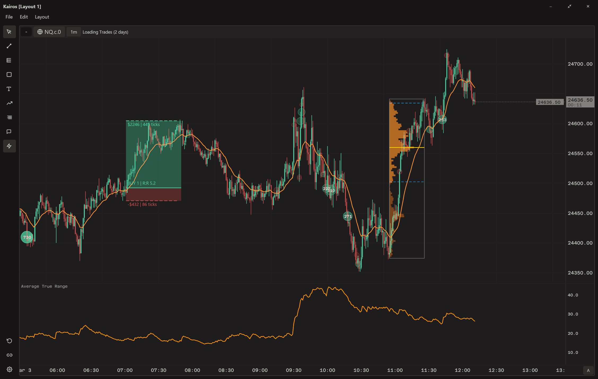
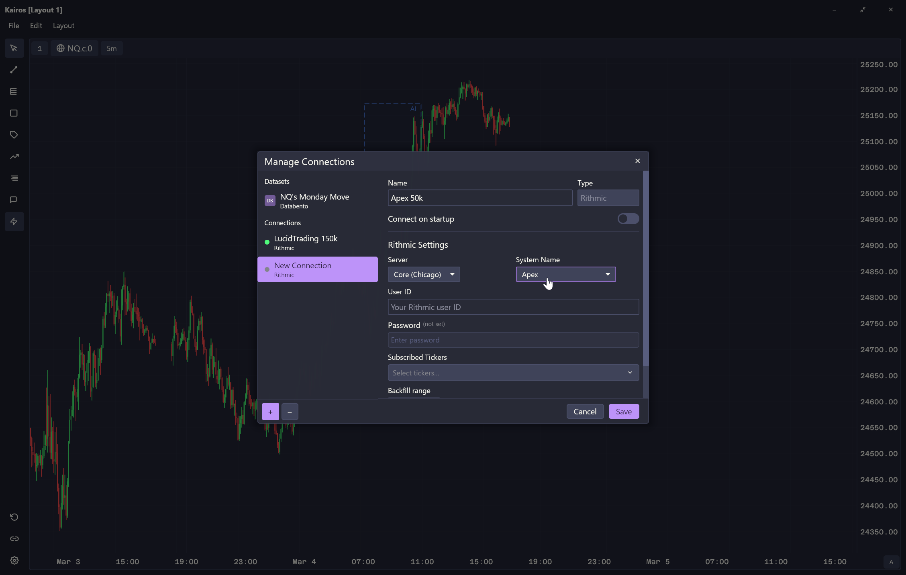
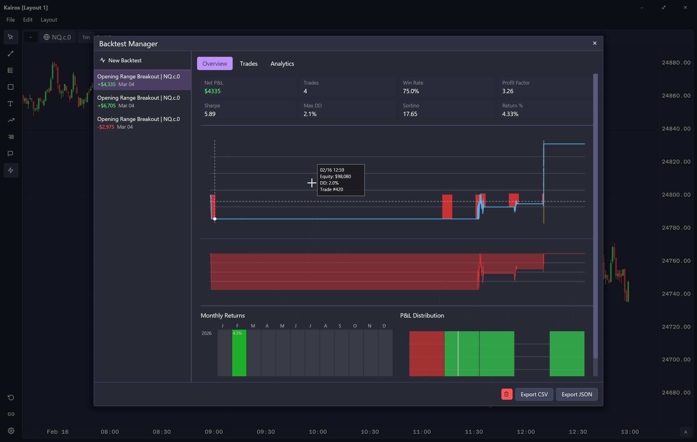
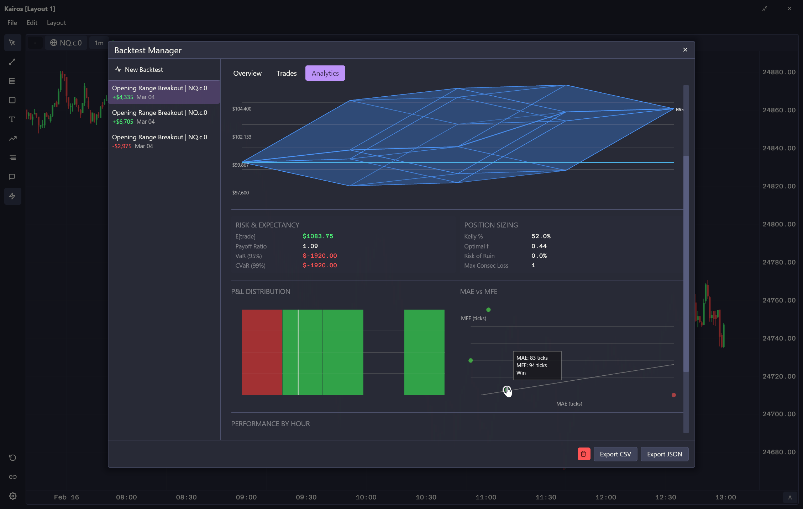
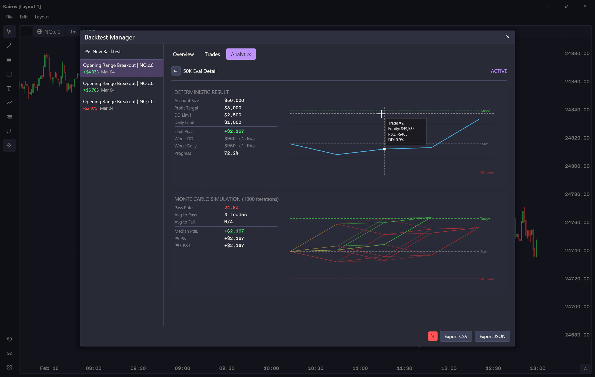
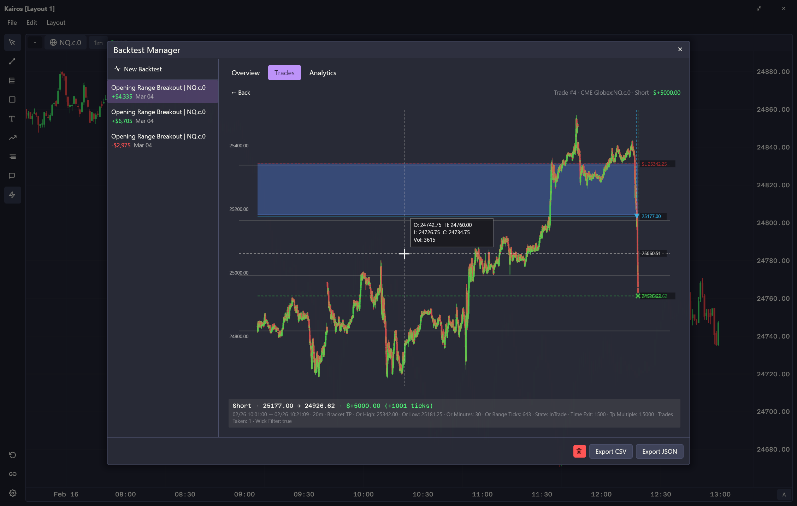
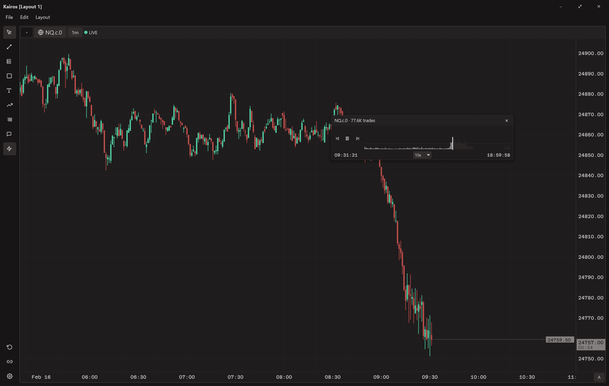

<div align="center">

  

  <p align="center">
    A native desktop charting platform for futures markets, built with Rust and <a href="https://github.com/iced-rs/iced">Iced</a>.
  </p>

</div>

<p align="center">
  
</p>

---

## Features

- **Candlestick & footprint charts** — OHLC with order-flow footprint overlay, 18 built-in technical studies, and a configurable side panel for volume profile
- **Depth heatmap** *(preview)* — Real-time order book depth visualization with trade markers and volume profile
- **Comparison charts** — Multi-series overlay for spread, ratio, or relative performance analysis
- **Volume profile charts** — Session and composite volume-at-price with POC, value area, and peak/valley detection
- **Depth ladder** *(preview)* — Live depth-of-market ladder with chase tracking, trade aggregation, and grouped price levels
- **19 drawing tools** — Lines, Fibonacci, channels, shapes, annotations, position calculators, and AI context selection
- **Real-time and historical data** — CME Globex via Databento (historical) and Rithmic (live streaming)
- **Multi-window layouts** — Popout panes, saved/restored layouts, and link groups for synchronized tickers
- **Replay** — Replay historical sessions with play/pause, speed control, and seek
- **AI assistant** *(preview)* — Conversational AI pane with 25+ tools for market data, studies, drawings, and analysis
- **Backtesting** *(preview)* — Event-driven strategy simulation with walk-forward optimization, Monte Carlo analysis, and 30+ performance metrics

---

## Downloads

Pre-built binaries for Windows, macOS (Universal), and Linux are available on the [latest release](https://gitlab.com/kreotic/kairos/-/releases/permalink/latest) page.

### System Requirements

- Windows x86_64, macOS (Universal), or Linux (x86_64 / aarch64)
- [Databento](https://databento.com) API key for historical data
- Rithmic credentials for live data (optional, configured through the app)

---

## Building from Source

Requires [Rust](https://rustup.rs/) (edition 2024).

```bash
cargo build --release
cargo run --release
```

### Testing

```bash
cargo test                           # All tests
cargo test --package kairos-data     # Data layer
cargo test --package kairos-study    # Study library
cargo test --package kairos-backtest # Backtest engine
cargo clippy                         # Lint
cargo fmt --check                    # Format check
```

---

## Data Providers

<p align="center">
  
</p>

### Databento — Historical Data

[Databento](https://databento.com) provides historical trade and MBO data for CME Globex futures.

1. Sign up at databento.com and get an API key
2. Set the `DATABENTO_API_KEY` environment variable, or enter it in the app (Settings > API Keys)
3. Use the download manager to fetch historical data by symbol and date range

Data is cached locally as bincode + zstd compressed files, organized by provider/symbol/schema/date.

### Rithmic — Real-Time Data

[Rithmic](https://rfrithmic.com) provides live market data and order book depth via the R|Protocol.

1. Obtain Rithmic credentials from your broker or a direct Rithmic account
2. Configure credentials in the app (Settings > Data Feeds) — passwords are stored securely in your OS keyring
3. Select the Rithmic server environment (e.g. Rithmic Paper, Rithmic 01)

The app connects to Rithmic's ticker, market data, and PnL plants for real-time trade, candle, and depth streaming.

---

## Backtesting

Event-driven backtesting engine with tick-level simulation, 30+ performance metrics, walk-forward optimization, and Monte Carlo analysis.

Custom strategies implement the `Strategy` trait with access to candles, studies, and a full order management API.

### Results & Analytics

<p align="center">
  
</p>
<p align="center"><em>Overview — equity curve, drawdown, monthly returns grid, and P&L distribution</em></p>

<p align="center">
  
</p>
<p align="center"><em>Analytics — 3D Monte Carlo surface, risk & expectancy metrics, MAE vs MFE scatter, performance by hour</em></p>

<p align="center">
  
</p>
<p align="center"><em>Prop firm evaluation detail with Monte Carlo simulation paths</em></p>

<p align="center">
  
</p>
<p align="center"><em>Trade detail — individual trade on chart with entry/exit markers, opening range highlight, and stats</em></p>

---

## AI Assistant

Conversational AI pane with streaming responses and 25+ built-in tools:

- **Market data** — chart info, candle data, current market state
- **Trade analysis** — aggregated trades, volume/delta profiles, session statistics
- **Study values** — read values from all active technical studies
- **Level detection** — automatic support/resistance identification via swing points, volume nodes, and round numbers
- **Drawing actions** — add/remove lines, shapes, Fibonacci, annotations, and price levels directly on the chart

The assistant receives a snapshot of the active chart's data and studies, enabling contextual analysis without leaving the platform.

---

## Replay

Replay historical trading sessions with full chart reconstruction — play/pause, adjustable speed, and seek to any point. All studies and drawings update in real-time.

<p align="center">
  
</p>

---

## Project Layout

| Crate | Lines | Description |
|-------|-------|-------------|
| `app/` | ~45K | Iced GUI application — chart rendering, pane system, modals, state management, AI assistant |
| `crates/data/` | ~15K | Domain types, data adapters (Databento, Rithmic), DataEngine facade, per-day file caching |
| `crates/study/` | ~8K | Technical analysis library — 18 studies with pure computation, no I/O dependencies |
| `crates/backtest/` | ~6K | Event-driven backtesting engine — strategies, fill simulation, optimization, performance analysis |

See [CLAUDE.md](CLAUDE.md) for detailed architecture, conventions, and module-level documentation.

---

## License

GPL-3.0-or-later
