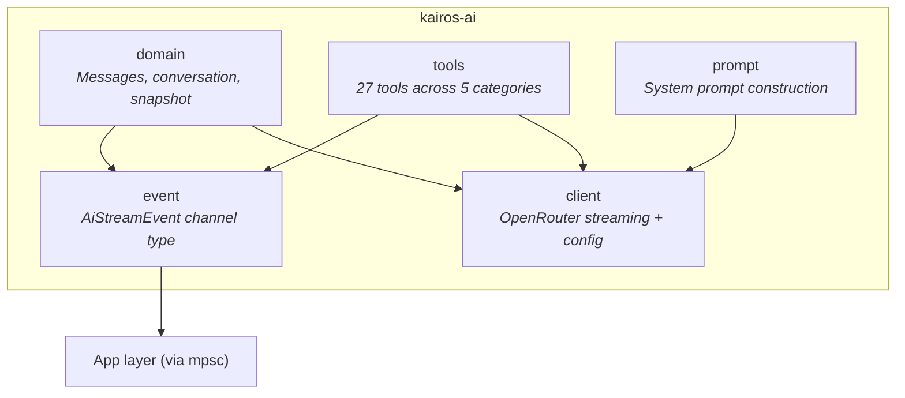
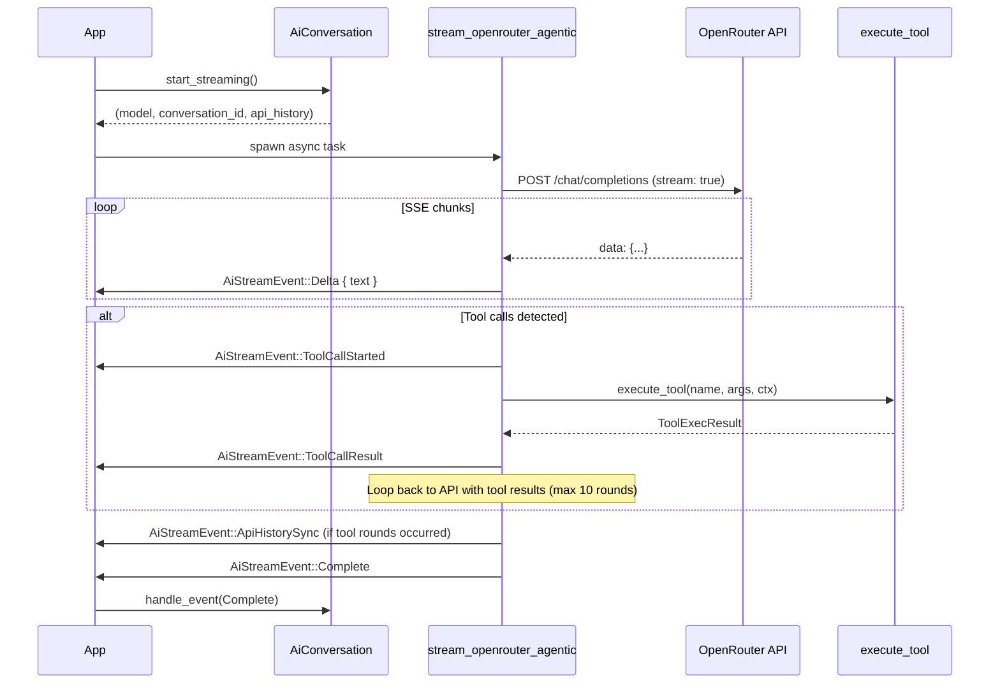

# kairos-ai

AI assistant engine for the Kairos charting platform.

| | |
|---|---|
| Version | `0.9.0` |
| License | GPL-3.0-or-later |
| Edition | 2024 |
| Depends on | `kairos-data` 0.9.0 |

## Overview

`kairos-ai` owns all GUI-independent AI logic — domain types, streaming client, tool execution,
and prompt construction. It has no Iced or rendering dependency and communicates with the app
layer exclusively through `AiStreamEvent` messages sent via a `tokio::sync::mpsc` channel.

The crate provides:

- Conversational AI state machine with streaming response handling
- Agentic tool-use loop with 27 tools across 5 categories (market data, trades, studies, analysis, drawing)
- Chart snapshot types for capturing pane state at request time
- `<think>` tag parsing for reasoning model chain-of-thought display
- System prompt construction with timezone-aware context
- OpenRouter API integration with SSE streaming

Design decisions:

- **No GUI code.** Everything compiles without Iced or any rendering dependency.
- **Decoupled drawing bridge.** Drawing tools emit `DrawingSpec` (flat geometry) rather than app-native `SerializableDrawing`. The app layer converts via a bridge module.
- **Stale event guard.** `stop_streaming()` rotates the conversation UUID so in-flight events from cancelled streams are silently discarded.
- **Agentic loop safety.** Hard cap of 10 tool rounds per request. The `ToolCallAccumulator` handles interleaved parallel tool calls in SSE streams.

## Architecture



## Module Structure

```text
src/
├── lib.rs                    # Crate root, public re-exports
├── event.rs                  # AiStreamEvent (9 variants), DrawingAction, DrawingSpec, ToolRoundSync
├── prompt.rs                 # build_system_prompt() with timezone context
├── domain/
│   ├── mod.rs                # Re-exports
│   ├── messages.rs           # ChatRole, ChatMessageKind, DisplayMessage, ApiMessage, TokenUsage
│   ├── conversation.rs       # AiConversation state machine, StreamingToolCall, ActiveContext
│   └── snapshot.rs           # ChartSnapshot and all snapshot subtypes
├── client/
│   ├── mod.rs                # Re-exports
│   ├── config.rs             # ModelOption, AI_MODELS, model lookup helpers
│   └── streaming.rs          # stream_openrouter_agentic(), build_api_messages()
└── tools/
    ├── mod.rs                # TimezoneResolver trait, ToolContext, build_tools_json(), execute_tool()
    ├── market_data.rs        # get_chart_info, get_candles, get_market_state
    ├── trades.rs             # get_trades, get_volume_profile, get_delta_profile, get_aggregated_trades
    ├── studies.rs            # get_study_values, get_big_trades, get_footprint, get_profile_data
    ├── analysis.rs           # get_drawings, get_session_stats, identify_levels
    └── drawing.rs            # 13 drawing tools (add/remove chart annotations)
```

## Modules

| Module | Description |
|--------|-------------|
| `domain` | Pure chat types with no I/O. `ChatRole` (4 variants), `ChatMessageKind` (7 variants for distinct UI bubble types including `Thinking` and `ContextAttachment`), `ApiMessage` (OpenAI wire format), `TokenUsage` (accumulates with K/M display formatting). |
| `domain::conversation` | `AiConversation` state machine maintaining parallel `messages` (UI) and `api_history` (wire) lists. Handles `<think>` tag routing, streaming buffer promotion, and stale event guarding via conversation ID rotation. |
| `domain::snapshot` | `ChartSnapshot` — immutable capture of all chart data at request time (candles, trades, footprints, volume profiles, study outputs, drawings, viewport bounds). Passed to the async streaming task. |
| `event` | `AiStreamEvent` enum (9 variants) for streaming output. `DrawingAction` / `DrawingSpec` types fully decoupled from app drawing types. `ToolRoundSync` carries completed tool call+result pairs for API history replay. |
| `client` | `stream_openrouter_agentic()` — async agentic loop posting to OpenRouter, streaming SSE, executing tools, looping up to 10 rounds. `build_api_messages()` converts history to wire format. Model registry with 5 pre-configured models. |
| `tools` | Central dispatcher with `TimezoneResolver` trait and `ToolContext`. 27 tools across 5 categories. `build_tools_json()` produces the OpenAI-format tools array. `execute_tool()` dispatches by name. |
| `prompt` | `build_system_prompt()` appends timezone context to a static prompt instructing the model as a CME Globex order flow analyst with tool usage guidelines and analysis framework. |

---

## Key Types

| Type | Module | Description |
|------|--------|-------------|
| `AiConversation` | `domain::conversation` | Full conversation state machine. Dual message lists (UI display + API wire), streaming buffers, `<think>` tag parser, model/token config. |
| `AiStreamEvent` | `event` | 9-variant channel enum: `Delta`, `ToolCallStarted`, `ToolCallResult`, `TextSegmentComplete`, `Complete`, `Error`, `ApiHistorySync`, `ApiKeyMissing`, `DrawingAction`. |
| `ChartSnapshot` | `domain::snapshot` | Immutable chart data capture: candles, trades, footprints, profiles, studies, drawings, viewport bounds, instrument metadata. |
| `DisplayMessage` | `domain::messages` | UI chat bubble: `ChatMessageKind` + timestamp. Seven kinds: User, AssistantText, ToolCall, ToolResult, Thinking, ContextAttachment, SystemNotice. |
| `ApiMessage` | `domain::messages` | OpenAI wire format message with role, content, optional tool calls, and tool call ID. |
| `DrawingSpec` | `event` | Flat geometry struct for drawing tool output. Contains all possible fields (price, time, color, label, fibonacci, etc.) with `Option` for unused fields. |
| `DrawingAction` | `event` | `Add { spec, description }`, `Remove { id, description }`, `RemoveAll { description }`. Decoupled from app's `SerializableDrawing`. |
| `ModelOption` | `client::config` | Static model entry: `id` + `display_name`. Five pre-registered models. |
| `TimezoneResolver` | `tools` | Trait for timezone conversion: `naive_to_utc_millis()` + `display_label()`. Implemented by app's `UserTimezone`. |
| `ToolContext` | `tools` | Bundles snapshot reference, event sender, conversation ID, and timezone for tool execution. |
| `TokenUsage` | `domain::messages` | Accumulator for prompt/completion tokens with formatted display (K/M suffixes). |

## Tools

27 tools across 5 categories, all operating on `ChartSnapshot` data:

### Market Data (3)

| Tool | Description |
|------|-------------|
| `get_chart_info` | Snapshot metadata: ticker, timeframe, chart type, candle count, live status |
| `get_candles` | OHLCV + delta with time-range and count filter (max 200, default 50) |
| `get_market_state` | Session high/low, cumulative volume/delta, last candle |

### Trades (4)

| Tool | Description |
|------|-------------|
| `get_trades` | Buy/sell volume per price level with time and price-range filters |
| `get_volume_profile` | POC + 68.2% value area; falls back to OHLC-distributed candle volume |
| `get_delta_profile` | (Buy - sell) delta by price level, sorted by magnitude |
| `get_aggregated_trades` | Time-bucketed buy/sell/delta/count/VWAP (10-3600s buckets, max 200) |

### Studies (4)

| Tool | Description |
|------|-------------|
| `get_study_values` | Latest N values from all active study outputs (lines, bars, levels) |
| `get_big_trades` | Last N entries from the Big Trades study |
| `get_footprint` | Per-candle footprint levels with buy/sell/delta (max 50 candles) |
| `get_profile_data` | Full VBP data: POC/VAH/VAL/HVN/LVN, sorted by volume (max 200 levels) |

### Analysis (3)

| Tool | Description |
|------|-------------|
| `get_drawings` | All chart drawings with type, points, label, visibility, lock status |
| `get_session_stats` | RTH/ETH session stats: OHLC, volume, delta, opening range, initial balance |
| `identify_levels` | Algorithmic S/R detection: swing pivots, volume nodes, round numbers |

### Drawing (13)

| Tool | Description |
|------|-------------|
| `add_horizontal_line` | Horizontal line at a price level |
| `add_vertical_line` | Vertical line at a timestamp |
| `add_text_annotation` | Text label at a price/time coordinate |
| `add_price_level` | Price level with optional label |
| `add_price_label` | Price label annotation |
| `add_line` | Line between two price/time points |
| `add_extended_line` | Extended line (ray) from two points |
| `add_rectangle` | Rectangle between two price/time corners |
| `add_ellipse` | Ellipse between two price/time corners |
| `add_arrow` | Arrow between two points |
| `add_fib_retracement` | Fibonacci retracement with configurable levels |
| `remove_drawing` | Remove a specific drawing by ID |
| `remove_all_drawings` | Remove all drawings from the chart |

## Streaming Flow



## Conversation State Machine

`AiConversation` maintains two parallel message lists:

- **`messages`** (`Vec<DisplayMessage>`) — UI display list with 7 bubble types
- **`api_history`** (`Vec<ApiMessage>`) — OpenAI wire format for API calls

Key behaviors:

- `handle_event(AiStreamEvent)` — mutates state for all event variants; returns `true` only for `ApiKeyMissing`
- `start_streaming()` — returns `(model, conversation_id, api_history_clone)` for the async task
- `stop_streaming()` — rotates `conversation_id` to invalidate in-flight events
- `commit_streaming_buffer()` — promotes thinking and text buffers to typed `DisplayMessage` entries
- `<think>` tag state machine routes deltas into `thinking_buffer` vs `streaming_buffer`

## Model Registry

Five pre-configured models via OpenRouter:

| ID | Display Name |
|----|-------------|
| `google/gemini-3-flash-preview` | Gemini 3 Flash (default) |
| `google/gemini-2.5-pro-preview` | Gemini 2.5 Pro |
| `anthropic/claude-sonnet-4` | Claude Sonnet 4 |
| `openai/gpt-4.1` | GPT-4.1 |
| `openai/o4-mini` | o4 mini |

---

## Dependencies

| Crate | Purpose |
|-------|---------|
| `kairos-data` | Market domain types: `Price`, `Trade`, `Candle`, `FuturesTicker`, `SerializableColor`, `Timeframe` |
| `serde` | Serialization for snapshot and message types |
| `serde_json` | JSON serialization for API wire format and tool arguments |
| `chrono` | Timestamps, timezone handling, date parsing |
| `uuid` | Conversation and session identifiers |
| `tokio` | Async runtime, `mpsc` channels for event streaming |
| `reqwest` | HTTP client for OpenRouter API with SSE streaming |
| `futures` | `StreamExt` for async SSE chunk processing |
| `log` | Diagnostic logging |

## License

GPL-3.0-or-later
