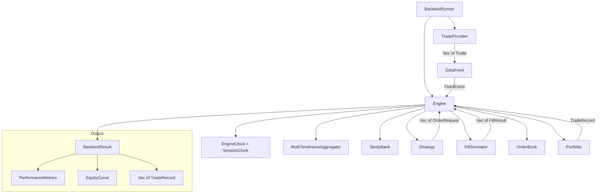
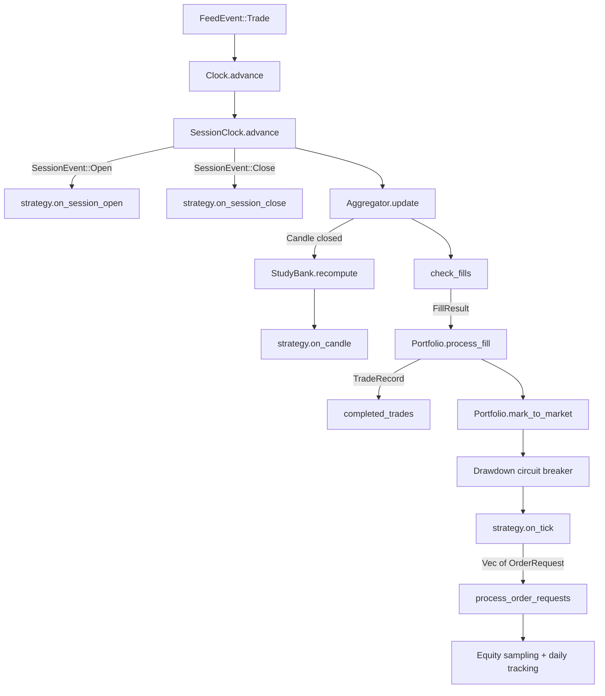
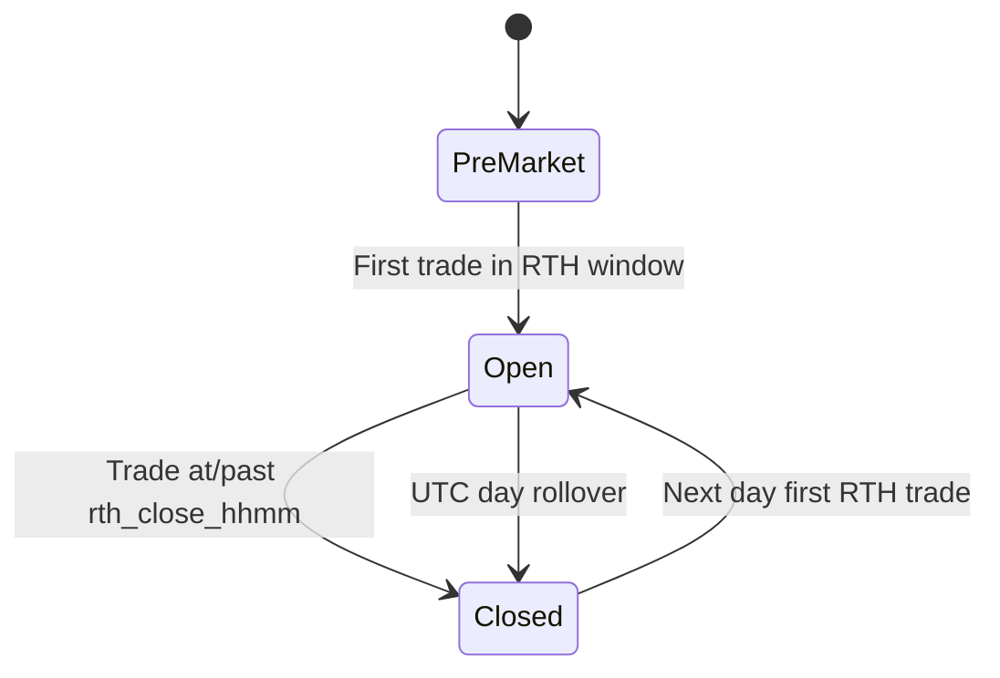
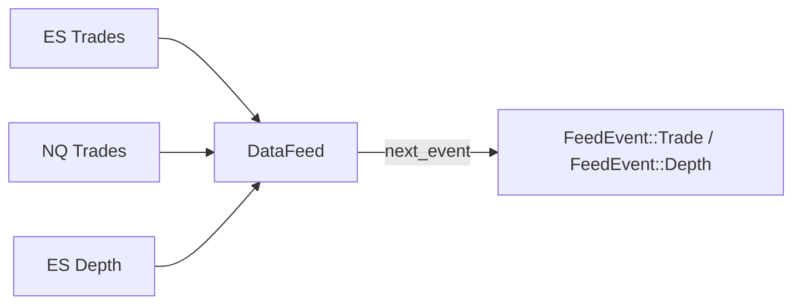
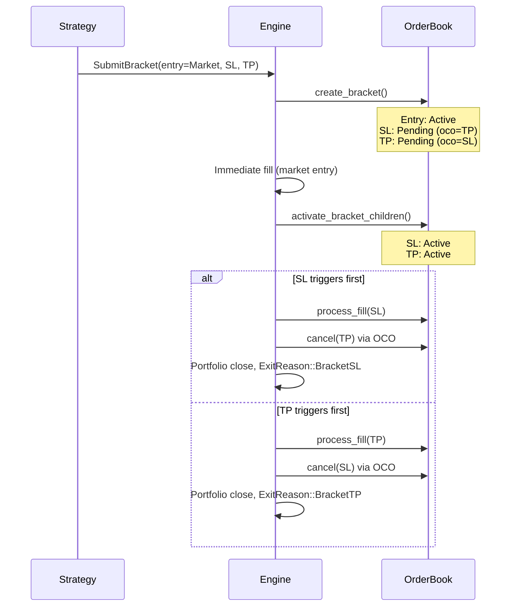
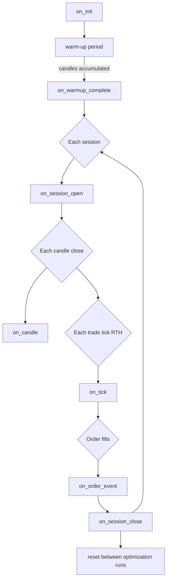
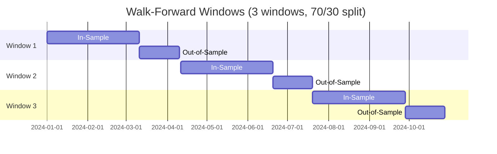

# kairos-backtest

Event-driven backtesting engine for futures trading strategies.

| | |
|---|---|
| Version | `0.1.0` |
| License | GPL-3.0-or-later |
| Edition | 2024 |
| Depends on | `kairos-data`, `kairos-study` |

## Overview

`kairos-backtest` is a deterministic simulation framework that replays historical trade data
through user-defined strategies with tick-level fidelity. It tracks orders, fills, positions,
and portfolio equity across configurable session boundaries, producing detailed performance
analytics.

The crate provides:

- Tick-level event-driven simulation with multi-timeframe candle aggregation
- Full order lifecycle management with bracket orders (entry + SL + TP via OCO linking)
- Pluggable fill simulation (slippage-based and depth-based models)
- Portfolio accounting with fixed-point P&L, margin enforcement, and MAE/MFE tracking
- Session-aware RTH boundary detection with configurable timezone offsets
- Walk-forward optimization with grid search over parameter spaces
- Monte Carlo simulation and bootstrap confidence intervals
- Real-time progress streaming for UI integration

## Architecture



### Event loop

On every tick the engine executes a fixed pipeline:



## Module structure

```
src/
├── lib.rs                    # Public API, crate-level re-exports
├── prelude.rs                # Convenience re-exports for strategy authors
│
├── config/                   # Backtest configuration
│   ├── backtest.rs           # BacktestConfig (top-level)
│   ├── instrument.rs         # InstrumentSpec (tick size, multiplier, margins)
│   ├── margin.rs             # MarginConfig, MarginCalculator
│   └── risk.rs               # RiskConfig, PositionSizeMode, SlippageModel
│
├── engine/                   # Core simulation
│   ├── kernel.rs             # Engine struct and main event loop
│   ├── runner.rs             # BacktestRunner (high-level facade)
│   ├── context.rs            # StrategyContext construction and cache
│   ├── clock/
│   │   ├── trading.rs        # EngineClock (monotonic time)
│   │   └── session.rs        # SessionClock (RTH boundary detection)
│   └── processing/
│       ├── orders.rs         # Order submission, bracket handling, flatten
│       └── fills.rs          # Fill detection and cascading effects
│
├── feed/                     # Historical data ingestion
│   ├── provider.rs           # TradeProvider trait (async)
│   ├── data_feed.rs          # DataFeed (multi-stream merge)
│   └── aggregation/
│       ├── candle.rs          # CandleAggregator, PartialCandle
│       └── multi_timeframe.rs # MultiTimeframeAggregator, AggregatorKey
│
├── fill/                     # Fill simulation
│   ├── mod.rs                # FillSimulator trait, FillResult
│   ├── market.rs             # StandardFillSimulator (slippage models)
│   ├── depth.rs              # DepthBasedFillSimulator (order book walk)
│   └── latency.rs            # LatencyModel, ZeroLatency, FixedLatency
│
├── order/                    # Order management
│   ├── types.rs              # OrderId, OrderSide, OrderType, OrderStatus, TimeInForce
│   ├── entity.rs             # Order struct and fill recording
│   ├── request.rs            # OrderRequest enum, NewOrder, BracketOrder
│   └── book.rs               # OrderBook (registry, bracket OCO linking)
│
├── portfolio/                # Portfolio accounting
│   ├── manager.rs            # Portfolio (central state machine)
│   ├── position.rs           # Position (VWAP entries, MAE/MFE)
│   ├── equity.rs             # EquityCurve, DailyEquityTracker
│   ├── accounting.rs         # Stateless P&L math (fixed-point)
│   └── margin.rs             # MarginCalculator (initial/maintenance)
│
├── strategy/                 # Strategy abstraction
│   ├── mod.rs                # Strategy trait, BacktestError, OrderEvent, StudyRequest
│   ├── context.rs            # StrategyContext, SessionState
│   ├── metadata.rs           # StrategyMetadata, StrategyCategory
│   ├── study_bank.rs         # StudyBank (indicator management)
│   ├── registry/
│   │   ├── mod.rs            # StrategyRegistry, StrategyInfo
│   │   └── built_in.rs       # register_all()
│   └── built_in/
│       ├── orb.rs            # Opening Range Breakout
│       ├── vwap_reversion.rs # VWAP Reversion
│       └── momentum_breakout.rs # Donchian Momentum Breakout
│
├── output/                   # Results and reporting
│   ├── result.rs             # BacktestResult
│   ├── metrics.rs            # PerformanceMetrics
│   ├── trade_record.rs       # TradeRecord, ExitReason
│   └── progress.rs           # BacktestProgressEvent (streaming)
│
├── analysis/                 # Post-run analysis
│   ├── statistics.rs         # t-test, bootstrap confidence intervals
│   └── monte_carlo.rs        # Monte Carlo trade shuffling
│
└── optimization/             # Parameter optimization
    ├── objective.rs          # ObjectiveFunction enum
    ├── parameter_space.rs    # ParameterRange, ParameterGrid
    ├── walk_forward.rs       # WalkForwardOptimizer, TimeWindow
    └── result.rs             # WindowResult, WalkForwardResult
```

---

<details>
<summary><strong>Configuration</strong></summary>

### BacktestConfig

Top-level configuration for a single backtest run.

| Field | Type | Description |
|-------|------|-------------|
| `ticker` | `FuturesTicker` | Primary instrument |
| `date_range` | `DateRange` | Inclusive start/end dates |
| `timeframe` | `Timeframe` | Primary candle period |
| `initial_capital_usd` | `f64` | Starting equity (must be > 0) |
| `risk` | `RiskConfig` | Position sizing, drawdown limits |
| `slippage` | `SlippageModel` | Fill price degradation model |
| `commission_per_side_usd` | `f64` | Per-contract fee per side |
| `timezone_offset_hours` | `i32` | UTC offset (e.g., -5 for ET) |
| `rth_open_hhmm` | `u32` | RTH open as HHMM (e.g., 930) |
| `rth_close_hhmm` | `u32` | RTH close as HHMM (e.g., 1600) |
| `strategy_id` | `String` | Strategy lookup key |
| `strategy_params` | `HashMap<String, ParameterValue>` | Parameter overrides |
| `additional_instruments` | `Vec<FuturesTicker>` | Multi-instrument support |
| `additional_timeframes` | `Vec<Timeframe>` | Multi-timeframe support |
| `warm_up_periods` | `usize` | Candles before strategy goes live |
| `use_depth_data` | `bool` | Load depth for fill simulation |
| `margin` | `MarginConfig` | Margin enforcement settings |
| `simulated_latency_ms` | `u64` | Order-to-fill delay (not yet integrated) |

`BacktestConfig::default_es(strategy_id)` provides sensible defaults for ES: 30-min candles,
$100k capital, $2.50/side commission, ET timezone, RTH 09:30-16:00.

### InstrumentSpec

Contract-level specifications with built-in CME Globex defaults via `InstrumentSpec::from_ticker()`:

| Product | Tick Size | Multiplier ($/pt) | Tick Value | Initial Margin | Maintenance |
|---------|-----------|-------------------|------------|----------------|-------------|
| ES | 0.25 | 50 | $12.50 | $15,900 | $14,400 |
| NQ | 0.25 | 20 | $5.00 | $21,000 | $19,000 |
| YM | 1.0 | 5 | $5.00 | $11,000 | $10,000 |
| RTY | 0.10 | 50 | $5.00 | $8,000 | $7,200 |
| GC | 0.10 | 100 | $10.00 | $11,000 | $10,000 |
| SI | 0.005 | 5,000 | $25.00 | $10,000 | $9,000 |
| CL | 0.01 | 1,000 | $10.00 | $7,000 | $6,400 |
| NG | 0.001 | 10,000 | $10.00 | $4,500 | $4,100 |
| HG | 0.0005 | 25,000 | $12.50 | $5,500 | $5,000 |
| ZN | 0.015625 | 1,000 | $15.625 | $2,200 | $2,000 |
| ZB | 0.03125 | 1,000 | $31.25 | $4,400 | $4,000 |
| ZF | 0.0078125 | 1,000 | $7.8125 | $1,400 | $1,300 |

### RiskConfig

| Field | Type | Default | Description |
|-------|------|---------|-------------|
| `position_size_mode` | `PositionSizeMode` | `Fixed(1.0)` | Contracts per trade |
| `max_concurrent_positions` | `usize` | `1` | Max simultaneous positions |
| `max_drawdown_pct` | `Option<f64>` | `None` | Circuit breaker (e.g., `Some(0.20)` = 20%) |
| `risk_free_annual` | `f64` | `0.05` | Annual risk-free rate for Sharpe/Sortino |

Position sizing modes:

- **`Fixed(n)`** -- always trade `n` contracts
- **`RiskPercent(pct)`** -- risk `pct` of equity per trade, sized by stop distance
- **`RiskDollars(usd)`** -- risk fixed USD amount per trade, sized by stop distance

### SlippageModel

| Variant | Description |
|---------|-------------|
| `None` | Fills at exact trade price |
| `FixedTick(n)` | `n` ticks of adverse slippage per fill |
| `Percentage(pct)` | Percentage of price (0.0 to 0.10) |
| `DepthBased` | Walk order-book depth for VWAP fill (requires `use_depth_data`) |
| `VolumeImpact { base_bps, average_daily_volume }` | Square-root market impact model |

### MarginConfig

| Field | Type | Default | Description |
|-------|------|---------|-------------|
| `enforce` | `bool` | `false` | Reject orders exceeding buying power |
| `initial_margin_override` | `Option<f64>` | `None` | Override per-instrument initial margin |
| `maintenance_margin_override` | `Option<f64>` | `None` | Override per-instrument maintenance margin |

When disabled (default), all orders are accepted regardless of available capital.

</details>

<details>
<summary><strong>Engine</strong></summary>

### BacktestRunner

High-level facade that orchestrates a complete backtest run:

1. Validates `BacktestConfig`
2. Applies strategy parameter overrides
3. Fetches historical trades via `TradeProvider`
4. Builds `DataFeed` and selects `FillSimulator`
5. Delegates to `Engine::run()` for simulation
6. Returns `BacktestResult`

```rust
let runner = BacktestRunner::new(trade_provider);
let result = runner.run(config, strategy).await?;

// Or with progress streaming:
let result = runner.run_with_progress(config, strategy, run_id, &sender).await?;
```

### Engine

The core simulation loop. Processes `FeedEvent`s from the `DataFeed` in strict chronological
order, coordinating all subsystems.

Key components managed by the engine:

| Component | Role |
|-----------|------|
| `EngineClock` | Monotonic time progression (rejects backward timestamps) |
| `SessionClock` | RTH boundary detection with configurable timezone/hours |
| `MultiTimeframeAggregator` | Trade-to-candle aggregation across instrument/timeframe pairs |
| `StudyBank` | Indicator computation on candle close |
| `OrderBook` | Order storage, bracket linking, activation |
| `FillSimulator` | Order matching against incoming trades |
| `Portfolio` | Position, equity, margin, and P&L tracking |

### Context caching

The engine uses a generation-based cache to avoid rebuilding `StrategyContext` on every tick.
The `MultiTimeframeAggregator` maintains a `generation` counter that increments each time any
candle closes. The engine only rebuilds its cached candle/partial maps when the generation
changes, then borrows from the cache to construct a zero-copy `StrategyContext`.

### Session lifecycle



The `SessionClock` converts UTC timestamps to local time using the configured offset and
emits `SessionEvent::Open` / `SessionEvent::Close` on transitions. Day orders are expired
at session close.

</details>

<details>
<summary><strong>Data feed and aggregation</strong></summary>

### TradeProvider

Async trait for fetching historical trade data. Implementors are provided by the application
layer (typically backed by `DataEngine`).

```rust
pub trait TradeProvider: Send + Sync {
    fn get_trades(
        &self,
        ticker: &FuturesTicker,
        date_range: &DateRange,
    ) -> Pin<Box<dyn Future<Output = Result<Vec<Trade>, String>> + Send + '_>>;
}
```

### DataFeed

Merges pre-sorted trade and depth streams from multiple instruments into a single
chronologically-ordered event sequence. Uses cursor-based iteration over each stream and
picks the earliest event on each call to `next_event()`. Trades win ties against depth
at the same timestamp.



### CandleAggregator

Aggregates individual trades into OHLCV candles for a single timeframe. Volume is tracked
separately by side (`buy_volume`, `sell_volume`) for order-flow analysis. Candles close when
a trade crosses a time-bucket boundary.

### MultiTimeframeAggregator

Manages one `CandleAggregator` per (instrument, timeframe) pair. A single trade is routed to
all aggregators matching its instrument, so one tick can close candles at multiple timeframes
simultaneously. Maintains a `generation` counter for cache invalidation.

</details>

<details>
<summary><strong>Order management</strong></summary>

### Order types

| Type | Description |
|------|-------------|
| `Market` | Fills immediately at trade price (with slippage) |
| `Limit { price }` | Fills when trade crosses limit (buy: trade <= price, sell: trade >= price) |
| `Stop { trigger }` | Becomes market when trigger hit (buy: trade >= trigger, sell: trade <= trigger) |
| `StopLimit { trigger, limit }` | Two-phase: trigger fires, then limit constraint checked |

### Time in force

| Variant | Behavior |
|---------|----------|
| `GTC` | Active until filled, cancelled, or backtest ends |
| `Day` | Auto-expired at RTH session close |
| `IOC` | Immediate or cancel |

### OrderRequest

Strategies communicate with the engine by returning `Vec<OrderRequest>` from lifecycle
callbacks. Available request types:

| Variant | Description |
|---------|-------------|
| `Submit(NewOrder)` | Submit a single order |
| `SubmitBracket(BracketOrder)` | Entry + SL + optional TP with OCO linking |
| `Cancel { order_id }` | Cancel specific order (cancels OCO partner too) |
| `CancelAll { instrument }` | Cancel all active orders (optionally filtered) |
| `Modify { order_id, new_price, new_quantity }` | Modify active order |
| `Flatten { instrument, reason }` | Cancel all orders + close position |
| `Noop` | No action |

### Bracket order lifecycle



</details>

<details>
<summary><strong>Fill simulation</strong></summary>

### FillSimulator trait

```rust
pub trait FillSimulator: Send + Sync {
    fn check_fills(
        &self,
        trade: &Trade,
        depth: Option<&Depth>,
        active_orders: &[&Order],
        instruments: &HashMap<FuturesTicker, InstrumentSpec>,
    ) -> Vec<FillResult>;

    fn market_fill_price(
        &self,
        trade: &Trade,
        side: OrderSide,
        quantity: f64,
        depth: Option<&Depth>,
        instrument: &InstrumentSpec,
    ) -> Price;
}
```

### StandardFillSimulator

Applies configurable slippage to market and stop fills. Slippage is always adverse (buys
pushed up, sells pushed down).

| Model | Formula |
|-------|---------|
| `None` | `price` |
| `FixedTick(n)` | `price +/- n * tick_size` |
| `Percentage(pct)` | `price * (1 +/- pct)` |
| `VolumeImpact` | `price * (1 +/- base_bps * sqrt(1/ADV) / 10000)` |

Limit orders fill at their limit price when triggered. Stop orders fill at trade price plus
slippage once the trigger condition is met.

### DepthBasedFillSimulator

Walks the order-book depth snapshot to compute a volume-weighted average fill price. For buy
orders, consumes ask levels from best to worst; for sell orders, consumes bid levels. Falls
back to `StandardFillSimulator` when no depth data is available.

### Latency models

`ZeroLatency` (default) and `FixedLatency` are defined but not yet integrated into the
engine. When integrated, orders will remain pending for the configured delay before becoming
eligible for fills.

</details>

<details>
<summary><strong>Portfolio</strong></summary>

### Portfolio

Central financial state machine managing cash, positions, and margin.

Key operations:

| Method | Description |
|--------|-------------|
| `process_fill()` | Open/scale-in/close positions, emit `TradeRecord` on round-trip |
| `mark_to_market()` | Update position mark prices and MAE/MFE, refresh peak equity |
| `check_margin()` | Validate buying power before order submission |
| `total_equity()` | `cash + unrealized_pnl` (mark-to-market valuation) |
| `buying_power()` | `cash - maintenance_margin_used` |
| `current_drawdown_pct()` | `(peak_equity - equity) / peak_equity * 100` |

### Position

Tracks a directional exposure in a single instrument with full scale-in support.

- **VWAP entry price**: recomputed on each same-side fill
- **MAE (Maximum Adverse Excursion)**: worst mark-to-market price (longs: lowest, shorts: highest)
- **MFE (Maximum Favorable Excursion)**: best mark-to-market price (longs: highest, shorts: lowest)
- **Initial stop loss**: stored for risk-reward ratio calculation

### P&L accounting

All tick-based calculations use fixed-point `Price` arithmetic (i64, 10^-8 precision) to
avoid floating-point drift:

```
pnl_ticks = (exit_price.units() - entry_price.units()) / tick_size.units()  // for longs
pnl_gross = pnl_ticks * tick_value * quantity
commission = commission_per_side * 2 * quantity
pnl_net   = pnl_gross - commission
```

### Margin

Two-tier margin model:

- **Initial margin**: required to open a new position (higher threshold)
- **Maintenance margin**: required to hold an existing position (lower threshold)

Resolution hierarchy: global override > per-instrument spec > zero (disabled).

### Equity tracking

- **EquityCurve**: sampled every 100 ticks during RTH. Records realized equity, unrealized
  P&L, and total equity at each point.
- **DailyEquityTracker**: one snapshot per UTC calendar day for daily return analysis.

</details>

<details>
<summary><strong>Strategy</strong></summary>

### Strategy trait

```rust
pub trait Strategy: Send + Sync {
    fn id(&self) -> &str;
    fn metadata(&self) -> StrategyMetadata;
    fn parameters(&self) -> &[ParameterDef];
    fn required_studies(&self) -> Vec<StudyRequest>;
    fn required_timeframes(&self) -> Vec<Timeframe>;

    fn on_init(&mut self, ctx: &StrategyContext);
    fn on_warmup_complete(&mut self, ctx: &StrategyContext);
    fn on_session_open(&mut self, ctx: &StrategyContext) -> Vec<OrderRequest>;
    fn on_candle(&mut self, instrument: FuturesTicker, timeframe: Timeframe,
                 candle: &Candle, ctx: &StrategyContext) -> Vec<OrderRequest>;
    fn on_tick(&mut self, ctx: &StrategyContext) -> Vec<OrderRequest>;
    fn on_session_close(&mut self, ctx: &StrategyContext) -> Vec<OrderRequest>;
    fn on_order_event(&mut self, event: OrderEvent, ctx: &StrategyContext) -> Vec<OrderRequest>;
    fn reset(&mut self);
    fn clone_strategy(&self) -> Box<dyn Strategy>;
}
```

### Lifecycle



### StrategyContext

Read-only snapshot of simulation state passed to every callback:

| Field | Type | Description |
|-------|------|-------------|
| `trade` | `&Trade` | Current trade tick |
| `candles` | `&HashMap<(Ticker, Timeframe), Vec<Candle>>` | Completed candles |
| `partial_candles` | `&HashMap<(Ticker, Timeframe), PartialCandle>` | In-progress candles |
| `depth` | `&HashMap<Ticker, Depth>` | Latest depth snapshots |
| `studies` | `&StudyBank` | Computed indicator outputs |
| `positions` | `&HashMap<Ticker, Position>` | Open positions |
| `active_orders` | `Vec<&Order>` | Working orders |
| `equity` | `f64` | Total account equity (cash + unrealized) |
| `cash` | `f64` | Cash balance |
| `buying_power` | `f64` | Available after margin |
| `drawdown_pct` | `f64` | Current drawdown from peak |
| `realized_pnl` | `f64` | Cumulative realized P&L |
| `timestamp` | `Timestamp` | Current simulation time |
| `local_hhmm` | `u32` | Local wall-clock as HHMM |
| `session_state` | `SessionState` | PreMarket / Open / Closed |
| `is_warmup` | `bool` | Whether engine is in warm-up period |

Convenience methods: `primary_candles()`, `primary_position()`, `primary_spec()`,
`tick_size()`, `contract_size()`, `unrealized_pnl()`.

### StudyBank

Manages indicator instances declared by a strategy via `required_studies()`. Each
`StudyRequest` specifies a key, a study ID (from `kairos-study` registry), and parameter
overrides. The bank recomputes all studies on primary candle close and provides output
retrieval by key.

### StrategyRegistry

Factory for strategy creation. `StrategyRegistry::with_built_ins()` (or `Default`) registers
all built-in strategies. Strategies are instantiated by ID via `registry.create("orb")`.

</details>

<details>
<summary><strong>Built-in strategies</strong></summary>

### Opening Range Breakout (`orb`)

Accumulates the opening range for the first N minutes of RTH, then trades breakouts above/below
the range with bracket orders.

| Parameter | Type | Range | Default | Description |
|-----------|------|-------|---------|-------------|
| `or_minutes` | int | 5-120 | 30 | Opening range accumulation window |
| `tp_multiple` | float | 0.5-5.0 | 1.5 | TP as multiple of OR range |
| `max_trades` | int | 1-3 | 1 | Max trades per session |
| `wick_filter` | bool | -- | true | Require candle close beyond OR level |
| `time_exit_hhmm` | int | 1200-1545 | 1500 | Time-based exit (HHMM) |
| `gap_skip` | bool | -- | true | Skip large gap sessions |

State machine: `WaitingForOpen` -> `AccumulatingOR` -> `WatchingForBreakout` -> `InTrade` -> `Done`

### VWAP Reversion (`vwap_reversion`)

Computes session VWAP with online weighted variance. Fades price deviations beyond
standard-deviation bands with optional slope filter.

| Parameter | Type | Range | Default | Description |
|-----------|------|-------|---------|-------------|
| `deviation_bands` | float | 0.5-4.0 | 2.0 | Std devs from VWAP for entry |
| `exit_at_vwap` | bool | -- | true | Exit at VWAP cross |
| `fixed_stop_ticks` | int | 5-200 | 20 | SL distance in ticks |
| `slope_filter_periods` | int | 0-50 | 10 | Periods for slope check (0=disabled) |
| `slope_threshold_pct` | float | 0.0-1.0 | 0.1 | Max slope % for entry |
| `time_exit_hhmm` | int | 1200-1545 | 1530 | Time-based exit (HHMM) |
| `max_trades` | int | 1-10 | 3 | Max trades per session |

### Momentum Breakout (`momentum_breakout`)

Donchian channel breakout with ATR-scaled bracket orders and trailing exit logic.

| Parameter | Type | Range | Default | Description |
|-----------|------|-------|---------|-------------|
| `entry_periods` | int | 5-200 | 20 | Donchian lookback for entry |
| `exit_periods` | int | 3-100 | 10 | Donchian lookback for trailing exit |
| `atr_period` | int | 5-100 | 14 | ATR lookback for stop |
| `atr_stop_multiplier` | float | 0.5-5.0 | 2.0 | Stop = ATR * multiplier |
| `allow_reentry` | bool | -- | true | Re-enter after close |
| `max_trades` | int | 1-20 | 5 | Max trades per session |

</details>

<details>
<summary><strong>Output and metrics</strong></summary>

### BacktestResult

Complete output from a single run:

| Field | Type | Description |
|-------|------|-------------|
| `id` | `Uuid` | Unique run identifier |
| `config` | `BacktestConfig` | Configuration used |
| `strategy_name` | `String` | Strategy display name |
| `run_duration_ms` | `u64` | Wall-clock runtime |
| `total_data_trades` | `usize` | Raw tick count processed |
| `trades` | `Vec<TradeRecord>` | All completed round-trips |
| `metrics` | `PerformanceMetrics` | Aggregated statistics |
| `equity_curve` | `EquityCurve` | Time-series equity |
| `sessions_processed` | `usize` | RTH sessions processed |
| `daily_snapshots` | `Vec<DailySnapshot>` | Per-day equity snapshots |
| `benchmark_pnl_usd` | `Option<f64>` | Buy-and-hold P&L |
| `warnings` | `Vec<String>` | Non-fatal issues |

### PerformanceMetrics

Computed by `PerformanceMetrics::compute()` from trade records and equity curve.

**P&L:**
`net_pnl_usd`, `gross_pnl_usd`, `total_commission_usd`, `net_pnl_ticks`

**Trade counts:**
`total_trades`, `winning_trades`, `losing_trades`, `breakeven_trades`

**Win/loss statistics:**
`win_rate`, `avg_win_usd`, `avg_loss_usd`, `profit_factor`, `avg_rr`,
`best_trade_usd`, `worst_trade_usd`, `largest_win_streak`, `largest_loss_streak`

**Drawdown:**
`max_drawdown_usd`, `max_drawdown_pct`

**Risk-adjusted ratios:**
- `sharpe_ratio` -- `mean(excess_daily_returns) / std(daily_returns) * sqrt(252)`
- `sortino_ratio` -- `mean(excess_daily_returns) / downside_deviation * sqrt(252)`
- `calmar_ratio` -- `annualized_return / abs(max_drawdown_pct)`

**Equity:**
`initial_capital_usd`, `final_equity_usd`, `total_return_pct`

**Trade excursion:**
`avg_mae_ticks`, `avg_mfe_ticks`

**Benchmark:**
`benchmark_return_pct`, `alpha_pct`

**Timing:**
`avg_trade_duration_ms`, `expectancy_usd`, `trading_days`

### TradeRecord

Individual round-trip trade with full entry/exit details, P&L in ticks and USD, MAE/MFE,
risk-reward ratio, holding time, and exit reason.

### ExitReason

| Variant | Description |
|---------|-------------|
| `StopLoss` | Fixed stop-loss triggered |
| `TakeProfit` | Fixed take-profit triggered |
| `TrailingStop` | Trailing stop triggered |
| `SessionClose` | End of RTH session |
| `Manual` | Strategy issued explicit close |
| `MaxDrawdown` | Portfolio drawdown circuit breaker |
| `EndOfData` | Data exhausted with open position |
| `BracketSL` | Bracket order stop-loss leg |
| `BracketTP` | Bracket order take-profit leg |
| `Flatten` | Flatten-all directive |

### BacktestProgressEvent

Streamed to a `tokio::sync::mpsc::UnboundedSender` during execution for real-time UI updates:

| Variant | Description |
|---------|-------------|
| `SessionProcessed { index, total_estimated }` | Session progress |
| `WarmUpComplete { candles_processed }` | Warm-up finished |
| `EquityUpdate { point }` | Periodic equity sample |
| `TradeCompleted { trade }` | Round-trip closed |
| `OrderEvent { description }` | Order lifecycle event |

</details>

<details>
<summary><strong>Analysis</strong></summary>

### Statistical tests

**`t_test_mean_returns(daily_returns)`** -- one-sample two-sided t-test on daily returns
against null hypothesis of zero mean. Returns `(t_statistic, p_value)`.

**`bootstrap_confidence_interval(values, iterations, confidence, metric_fn)`** -- resamples
with replacement using a deterministic LCG (seed 42) and returns percentile-method bounds.

### Monte Carlo simulation

Shuffles completed trades with replacement across `N` iterations to estimate the distribution
of possible outcomes.

```rust
let sim = MonteCarloSimulator::new(10_000);
let result = sim.simulate(&trades, initial_capital);

// result.equity_percentiles  -- p5, p25, p50, p75, p95
// result.drawdown_percentiles
// result.probability_of_loss
```

Returns `MonteCarloResult` with:

| Field | Type | Description |
|-------|------|-------------|
| `final_equities` | `Vec<f64>` | Final equity per iteration |
| `max_drawdowns` | `Vec<f64>` | Max drawdown % per iteration |
| `equity_percentiles` | `Percentiles` | p5, p25, p50, p75, p95 |
| `drawdown_percentiles` | `Percentiles` | p5, p25, p50, p75, p95 |
| `probability_of_loss` | `f64` | Fraction ending below initial capital |

Uses deterministic LCG seeded at 42 for reproducibility.

</details>

<details>
<summary><strong>Optimization</strong></summary>

### ObjectiveFunction

Scalar criterion to maximize during parameter search:

| Variant | Metric |
|---------|--------|
| `NetPnl` | Total net P&L (USD) |
| `SharpeRatio` | Annualized Sharpe |
| `SortinoRatio` | Annualized Sortino |
| `ProfitFactor` | Gross wins / gross losses (capped at 1000) |
| `CalmarRatio` | Annualized return / max drawdown |
| `WinRate` | Fraction profitable |
| `Expectancy` | Per-trade expectancy (USD) |

### ParameterGrid

Generates the Cartesian product of parameter ranges for exhaustive grid search.

```rust
let grid = ParameterGrid::new(vec![
    ParameterRange::integer("period", 10, 50, 10),   // [10, 20, 30, 40, 50]
    ParameterRange::float("alpha", 0.1, 0.3, 0.1),   // [0.1, 0.2, 0.3]
]);
// grid.total_combinations() == 15
```

### Walk-forward optimization

Guards against curve-fitting by dividing history into rolling in-sample/out-of-sample windows.



**WalkForwardConfig:**

| Field | Type | Description |
|-------|------|-------------|
| `date_range` | `DateRange` | Full date range to partition |
| `in_sample_ratio` | `f64` | Fraction for training (e.g., 0.7) |
| `num_windows` | `usize` | Number of rolling windows |
| `objective` | `ObjectiveFunction` | Criterion to maximize in-sample |
| `grid` | `ParameterGrid` | Parameters to search |

**WalkForwardResult:**

| Field | Type | Description |
|-------|------|-------------|
| `windows` | `Vec<WindowResult>` | Per-window IS/OOS metrics and best params |
| `aggregate_oos_objective` | `f64` | Mean out-of-sample objective |
| `aggregate_oos_pnl` | `f64` | Total out-of-sample net P&L |
| `combinations_per_window` | `usize` | Grid combinations tested per window |

</details>

---

## Usage

```rust
use std::sync::Arc;
use kairos_backtest::prelude::*;

// 1. Provide a TradeProvider implementation
let provider: Arc<dyn TradeProvider> = /* app-specific */;
let runner = BacktestRunner::new(provider);

// 2. Configure the backtest
let config = BacktestConfig::default_es("orb");

// 3. Create a strategy from the registry
let registry = StrategyRegistry::default();
let strategy = registry.create("orb").unwrap();

// 4. Run
let result = runner.run(config, strategy).await?;

println!("Net P&L: ${:.2}", result.metrics.net_pnl_usd);
println!("Sharpe:  {:.2}", result.metrics.sharpe_ratio);
println!("Trades:  {}", result.metrics.total_trades);
```

---

## Dependencies

| Crate | Purpose |
|-------|---------|
| `kairos-data` | Market types (`Trade`, `Depth`, `Candle`, `Price`, `FuturesTicker`, `Timeframe`) |
| `kairos-study` | Technical indicators (`Study` trait, `StudyRegistry`, parameter types) |
| `tokio` (sync) | `mpsc::UnboundedSender` for progress event streaming |
| `serde` | Serialization of config, results, and trade records |
| `uuid` | Unique run identifiers |
| `chrono` | Date/time handling for session boundaries |
| `thiserror` | Error type derivation |
| `log` | Diagnostic logging |

## License

GPL-3.0-or-later
