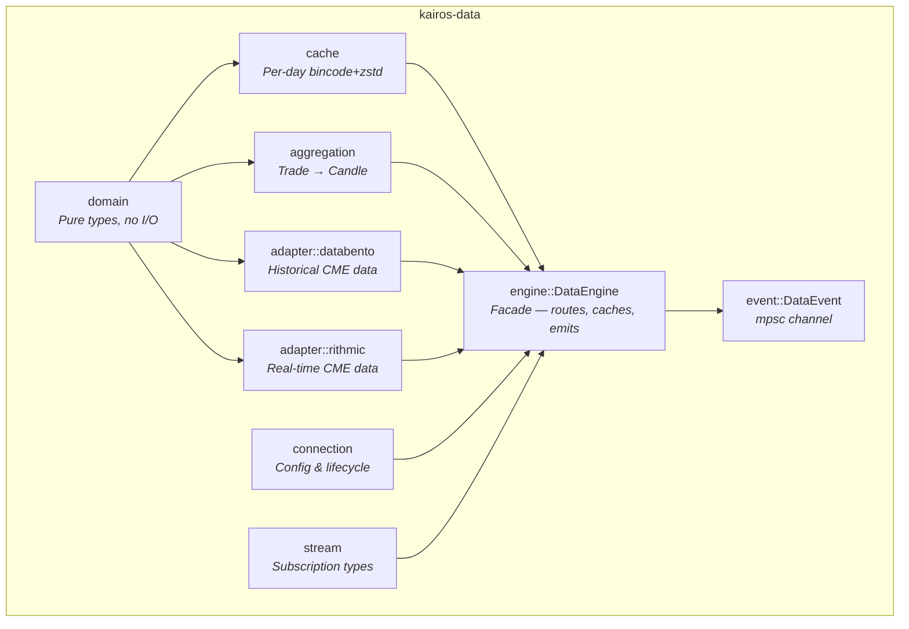
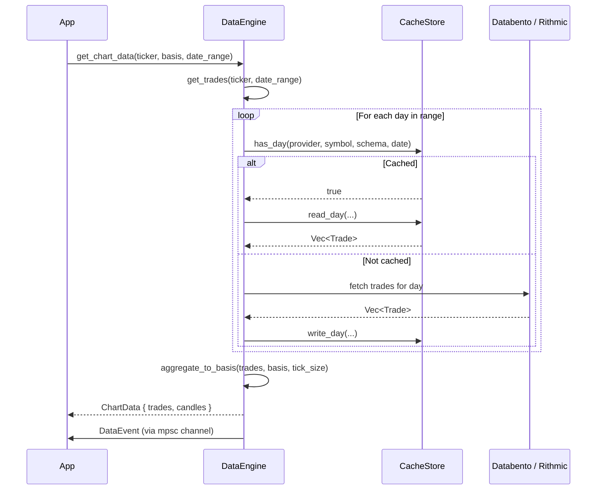
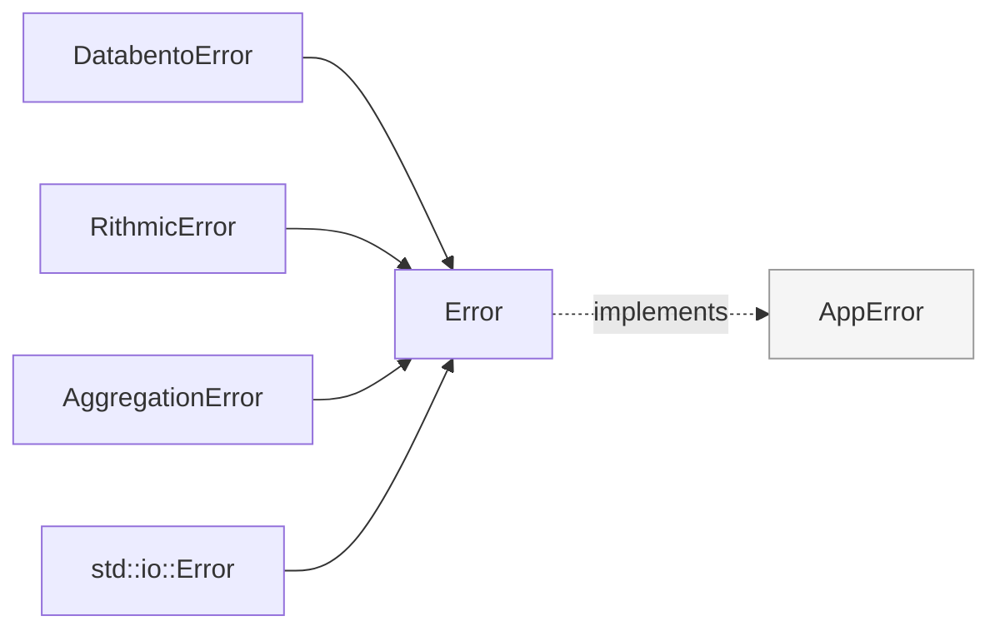
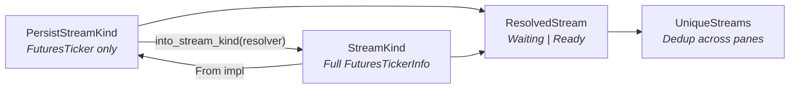

# kairos-data

Unified data infrastructure for the Kairos charting platform.

| | |
|---|---|
| Version | `0.9.0` |
| License | GPL-3.0-or-later |
| Edition | 2024 |
| Depends on | |

## Overview

`kairos-data` is the foundation crate of the Kairos workspace. It owns every type that touches
market data — from the fixed-point `Price` through raw `Trade` and `Depth` records, up to the
`DataEngine` that routes requests to adapters and delivers results via an event channel.

The crate is consumed by:
- **`kairos` (app)** — subscribes to `DataEvent`s, calls `DataEngine` methods, renders domain
  types in charts and panels.
- **`kairos-study`** — receives `Trade` and `Candle` slices for indicator computation.
- **`kairos-backtest`** — loads historical `Trade` data through the engine for strategy simulation.

Design decisions:
- **No GUI code.** Everything in this crate compiles without Iced or any rendering dependency.
- **Fixed-point arithmetic.** All monetary values use `Price` (i64, 10^-8 precision) to eliminate
  floating-point rounding errors in order-book and P&L math.
- **Cache-first data access.** The engine checks per-day cache files before making any network
  request, and transparently writes fetched data to cache for future use.
- **Feature-gated adapters.** Databento and Rithmic adapters are behind feature flags so downstream
  crates can depend on domain types without pulling in exchange SDKs.

## Architecture



## Modules

| Module | Description |
|--------|-------------|
| `domain` | Pure value objects and entities — `Price`, `Trade`, `Candle`, `Depth`, `FuturesTicker`, `FuturesTickerInfo`, `DataIndex`, `DateRange`, `TimeRange`, `Side`, `Volume`, `Quantity`, `Timestamp`. No I/O, no async. |
| `adapter` | Exchange adapters (feature-gated). `databento` fetches historical CME Globex trades and depth via the Databento HTTP API. `rithmic` streams real-time and historical CME data via R\|Protocol WebSockets. |
| `aggregation` | Trade-to-candle aggregation: `aggregate_trades_to_candles` (time-based), `aggregate_trades_to_ticks` (tick-based), `aggregate_candles_to_timeframe` (re-aggregation to higher timeframes). |
| `cache` | Per-day file storage using bincode serialization compressed with zstd (level 3). Atomic writes via `.tmp` + rename. Supports scan, eviction, and statistics. |
| `connection` | `ConnectionManager` stores configured `Connection`s. `ConnectionProvider` (Databento/Rithmic), `ConnectionStatus` lifecycle, `ConnectionCapability` for capability queries. |
| `engine` | `DataEngine` facade. Routes data requests to the best available adapter, manages the shared `CacheStore`, maintains a `DataIndex`, and emits `DataEvent`s through an mpsc channel. |
| `stream` | Two-tier subscription model. `PersistStreamKind` stores only a ticker symbol for serialization. `StreamKind` holds full `FuturesTickerInfo` for runtime use. `UniqueStreams` deduplicates across panes. |
| `event` | `DataEvent` enum covering connection lifecycle, live market data, subscription status, download progress, and data availability changes. Delivered via `mpsc::UnboundedReceiver`. |
| `error` | `Error` enum (9 variants) with `AppError` trait providing `user_message()`, `is_retriable()`, and `severity()` for every error. Adapter errors convert via `From` impls. |
| `util` | Formatting helpers, math utilities, time conversions, serde helpers, and logging configuration. |

## Module Structure

```text
src/
├── lib.rs                          # Public API, crate-level re-exports
├── error.rs                        # Error enum (9 variants) with AppError impl
├── event.rs                        # DataEvent enum
├── domain/
│   ├── mod.rs                      # Re-exports
│   ├── core/
│   │   ├── types.rs                # Price, Volume, Quantity, Timestamp, Side, DateRange
│   │   ├── price.rs                # PriceStep, PriceExt, MinTicksize, Power10
│   │   ├── color.rs                # SerializableColor
│   │   └── error.rs                # ErrorSeverity, AppError trait
│   ├── market/
│   │   └── entities.rs             # Trade, Candle, Depth, MarketData
│   ├── instrument/
│   │   └── futures.rs              # FuturesTicker, FuturesTickerInfo, ContractSpec, Timeframe
│   ├── data/
│   │   ├── index.rs                # DataIndex
│   │   └── registry.rs             # DownloadedTickersRegistry
│   ├── chart/
│   │   ├── config.rs               # ChartConfig, ChartType
│   │   ├── data.rs                 # ChartData, ChartBasis
│   │   ├── heatmap.rs              # HeatmapIndicator
│   │   └── kline.rs                # KlineConfig
│   ├── assistant.rs                # AI assistant types
│   └── replay/                     # Replay state types
├── adapter/
│   ├── mod.rs                      # AdapterError, Event enum
│   ├── databento/                  # Historical CME Globex via Databento API
│   │   ├── client.rs               # DatabentoAdapter
│   │   ├── decoder.rs              # DBN record decoding
│   │   ├── fetcher/                # Fetch orchestration (trades, depth, downloads, gaps)
│   │   ├── mapper.rs               # Databento → domain type mapping
│   │   └── symbology.rs            # Continuous contract symbol resolution
│   └── rithmic/                    # Real-time CME via R|Protocol WebSockets
│       ├── client.rs               # RithmicClient
│       ├── mapper.rs               # Rithmic → domain type mapping
│       ├── plants/                 # Ticker plant, history plant, pool
│       ├── pool.rs                 # HistoryPlantPool
│       ├── protocol/               # WebSocket, protobuf, ping, auth
│       └── streaming.rs            # RithmicStream
├── aggregation/
│   ├── mod.rs                      # Re-exports
│   ├── time_based.rs               # aggregate_trades_to_candles, aggregate_candles_to_timeframe
│   └── tick_based.rs               # aggregate_trades_to_ticks
├── cache/
│   ├── mod.rs                      # Re-exports
│   ├── store.rs                    # CacheStore (read, write, scan, evict)
│   ├── format.rs                   # DayFileHeader, wire format
│   ├── live_buffer.rs              # LiveBuffer for streaming data
│   └── stats.rs                    # CacheStats
├── connection/
│   ├── mod.rs                      # Re-exports
│   ├── manager.rs                  # ConnectionManager
│   ├── config.rs                   # ConnectionConfig variants
│   └── types.rs                    # Connection, ConnectionProvider, ConnectionStatus
├── engine/
│   ├── mod.rs                      # DataEngine
│   ├── chart.rs                    # Chart data loading
│   └── merger.rs                   # Feed merger
├── stream/
│   ├── mod.rs                      # Re-exports
│   ├── kind.rs                     # StreamKind, PersistStreamKind
│   ├── resolved.rs                 # ResolvedStream
│   ├── schema.rs                   # DownloadSchema
│   └── unique.rs                   # UniqueStreams, StreamSpecs
└── util/
    ├── mod.rs                      # Re-exports
    ├── formatting.rs               # Display formatting helpers
    ├── time.rs                     # Time conversion utilities
    ├── math.rs                     # Math utilities
    ├── serde.rs                    # Serde helpers
    └── logging.rs                  # Logging configuration
```

---

## Key Types

| Type | Module | Description |
|------|--------|-------------|
| `Price` | `domain::core::types` | Fixed-point i64 with 10^-8 precision (`PRECISION = 100_000_000`). Saturating `Add`/`Sub`, checked variants, `Mul<f64>`, `Div<i64>`. |
| `Trade` | `domain::market::entities` | Single execution: `time: Timestamp`, `price: Price`, `quantity: Quantity`, `side: Side`. Copy type. |
| `Candle` | `domain::market::entities` | OHLCV bar with separate `buy_volume`/`sell_volume`. Validated constructor rejects invalid high/low. |
| `Depth` | `domain::market::entities` | Order book snapshot. `time: u64` (millis), `bids: BTreeMap<i64, f32>`, `asks: BTreeMap<i64, f32>`. Keys are raw price units. |
| `FuturesTicker` | `domain::instrument::futures` | Stack-allocated 28-byte inline symbol. No heap allocation. Includes venue, product root (8 bytes), optional display name (28 bytes). |
| `FuturesTickerInfo` | `domain::instrument::futures` | Wraps `FuturesTicker` with `tick_size: f32`, `min_qty: f32`, `contract_size: f32`. Copy type. |
| `Timestamp` | `domain::core::types` | `u64` milliseconds since Unix epoch. Converts to/from `chrono::DateTime<Utc>`. |
| `DateRange` | `domain::core::types` | Inclusive `NaiveDate` range with iteration, validation, and convenience constructors (`last_n_days`, `last_week`). |
| `DataEngine` | `engine` | Primary API facade. Owns adapters, cache, data index, and event sender. See [DataEngine API](#dataengine-api). |
| `DataEvent` | `event` | 11-variant enum covering the full lifecycle from connection to download completion. See [DataEvent Reference](#dataevent-reference). |
| `DataIndex` | `domain::data::index` | Tracks which tickers, schemas, and date ranges are available from which feed. Supports merge and feed removal. |
| `ConnectionManager` | `connection::manager` | Stores `Connection`s, resolves the best data source by priority and capability. |
| `PriceStep` | `domain::core::price` | Tick step in atomic price units. Converts between display tick sizes (e.g. 0.25) and internal fixed-point. |
| `PriceExt` | `domain::core::price` | Extension trait for precision-aware formatting and tick rounding on `Price`. |

## DataEngine API

`DataEngine::new(cache_root)` returns `(DataEngine, mpsc::UnboundedReceiver<DataEvent>)`. The
app subscribes to the receiver in an Iced subscription.

### Connection lifecycle

| Method | Feature | Description |
|--------|---------|-------------|
| `connect_databento(config)` | `databento` | Connects the Databento adapter, scans cache, emits `Connected` + `DataIndexUpdated`. Returns `FeedId`. |
| `connect_rithmic(config, conn_config)` | `rithmic` | Connects with 30-second timeout, creates history pool, scans Rithmic cache. Returns `(FeedId, Arc<Mutex<RithmicClient>>)`. |
| `disconnect(feed_id)` | — | Removes the adapter, cleans the index, emits `Disconnected`. |

### Data access

| Method | Description |
|--------|-------------|
| `get_trades(ticker, date_range)` | Cache-first trade fetch. Priority: Databento → Rithmic. Rithmic path fetches uncached days in parallel via the history pool, caches results. |
| `get_depth(ticker, date_range)` | Depth snapshots (Databento only). |
| `get_chart_data(ticker, basis, date_range, ticker_info)` | Fetches trades, aggregates to the requested `ChartBasis` (time or tick), returns `ChartData`. |
| `rebuild_chart_data(trades, basis, ticker_info)` | Re-aggregates existing trades to a new basis. No I/O — instant. |

### Cache & index

| Method | Description |
|--------|-------------|
| `data_index()` | Returns `&Arc<Mutex<DataIndex>>`. |
| `scan_cache()` | Walks all provider cache directories and returns a merged `DataIndex`. |
| `list_cached_dates(symbol, schema)` | Returns `BTreeSet<NaiveDate>` of cached dates across all providers. |
| `cache_stats()` | Returns `CacheStats` (file count, total size, oldest file). |

### Events & download

| Method | Description |
|--------|-------------|
| `event_sender()` | Clones the `mpsc::UnboundedSender<DataEvent>` for external use. |
| `download_to_cache(ticker, schema, date_range)` | Downloads data to cache, emits `DownloadProgress` and `DownloadComplete`, re-scans index. Routes to Databento or Rithmic. |

## Feature Flags

| Flag | Default | Dependencies | Description |
|------|---------|-------------|-------------|
| `databento` | yes | `databento`, `time`, `dirs-next` | Databento adapter for CME Globex historical data (trades, depth, OHLCV). |
| `rithmic` | yes | `prost`, `tokio-tungstenite`, `futures-util`, `chrono-tz` | Rithmic adapter for CME real-time streaming and historical tick replay via R\|Protocol. |
| `heatmap` | no | — | Enables `Depth` variants in `DataEvent` and `StreamKind`, plus `HeatmapIndicator` type. |

## Data Flow



## Price Convention

All prices use the `Price` type — an `i64` storing atomic units at 10^-8 precision.

```rust
Price::PRECISION    = 100_000_000  // 10^8
Price::PRICE_SCALE  = 8           // number of decimal places

// Construction
let p = Price::from_f32(5025.25);  // → i64 units: 502_525_000_000
let p = Price::from_units(502_525_000_000);

// Conversion
p.to_f32()  // → 5025.25 (lossy)
p.to_f64()  // → 5025.25
p.units()   // → 502_525_000_000

// Arithmetic (saturating — never panics)
let sum = price_a + price_b;   // saturating add
let diff = price_a - price_b;  // saturating sub
let scaled = price * 2.0;      // Mul<f64>
let half = price / 2;          // Div<i64>

// Checked variants return None on overflow
price.checked_add(other)
price.checked_sub(other)

// Tick rounding
price.round_to_tick(tick_size)  // round to nearest multiple
price.add_steps(n, step)       // move n ticks (saturating)
```

Databento wire prices use 10^-9 precision. The `convert_databento_price` function converts to
10^-8 with banker's rounding: `(value + signum * 5) / 10`.

---

<details>
<summary><strong>Cache Format</strong></summary>

### Directory layout

```
{cache_root}/
  {provider}/              -- "databento" | "rithmic"
    {symbol-sanitized}/    -- dots replaced with dashes: "ES-c-0"
      trades/
        2025-01-15.bin.zst
      depth/
        2025-01-15.bin.zst
      ohlcv/
        2025-01-15.bin.zst
```

### Wire format

Each `.bin.zst` file is a single zstd frame (compression level 3) containing:

```
[4 bytes] header_len    (u32 LE)
[N bytes] header        (bincode-serialized DayFileHeader)
[M bytes] records       (bincode-serialized Vec<T>)
```

`DayFileHeader` fields:
- `magic: u32` — `0x4B414952` (ASCII "KAIR")
- `version: u8` — currently `1`
- `schema: String` — `"trades"`, `"depth"`, or `"ohlcv"`
- `symbol: String` — e.g. `"ES.c.0"`
- `date: String` — ISO date `"YYYY-MM-DD"`
- `record_count: u64`

### Write atomicity

Writes go to a `.bin.zst.tmp` file first, then `rename` to the final path. This prevents
partial-write corruption — readers either see the complete previous version or the complete new
version. Reads are lock-free (immutable files, async fs I/O).

### Eviction

`CacheStore::evict_old(provider, max_age_days)` recursively deletes files whose `mtime` is older
than the cutoff.

</details>

<details>
<summary><strong>Error Handling</strong></summary>



### Error variants

| Variant | Retriable | Severity | Description |
|---------|-----------|----------|-------------|
| `Fetch(String)` | yes | Warning | Network, timeout, or adapter-level fetch failure |
| `Config(String)` | no | Recoverable | Invalid or missing configuration |
| `Cache(String)` | no | Recoverable | Cache read/write/decode failure |
| `Symbol(String)` | no | Recoverable | Ticker symbol not found or invalid |
| `Connection(String)` | yes | Warning | Connection failed or was lost |
| `Validation(String)` | no | Recoverable | Input validation failed |
| `NoData(String)` | no | Info | No data available for the requested range |
| `Aggregation(AggregationError)` | no | Recoverable | Trade/candle aggregation error |
| `Io(String)` | no | Recoverable | Filesystem I/O error |

### AppError trait

All error types implement `AppError`:

```rust
pub trait AppError: std::error::Error {
    fn user_message(&self) -> String;  // UI-safe message
    fn is_retriable(&self) -> bool;    // can the operation be retried?
    fn severity(&self) -> ErrorSeverity; // Info | Warning | Recoverable | Critical
}
```

### Adapter error conversion

`DatabentoError` and `RithmicError` convert to `Error` via `From` impls:
- `DatabentoError::Api` / `Dbn` → `Error::Fetch`
- `DatabentoError::SymbolNotFound` → `Error::Symbol`
- `RithmicError::Connection` → `Error::Connection`
- `RithmicError::Auth` / `Config` → `Error::Config`
- `RithmicError::Subscription` / `Data` → `Error::Fetch`

</details>

<details>
<summary><strong>Supported Instruments</strong></summary>

12 CME Globex continuous front-month contracts via Databento (`GLBX.MDP3` dataset):

| Symbol | Product | Tick Size | Min Qty | Contract Size | Description |
|--------|---------|-----------|---------|---------------|-------------|
| `ES.c.0` | ES | 0.25 | 1 | 50 | E-mini S&P 500 |
| `NQ.c.0` | NQ | 0.25 | 1 | 20 | E-mini Nasdaq 100 |
| `YM.c.0` | YM | 1.0 | 1 | 5 | E-mini Dow |
| `RTY.c.0` | RTY | 0.1 | 1 | 50 | E-mini Russell 2000 |
| `ZN.c.0` | ZN | 1/64 (0.015625) | 1 | 1000 | 10-Year T-Note |
| `ZB.c.0` | ZB | 1/32 (0.03125) | 1 | 1000 | 30-Year T-Bond |
| `HG.c.0` | HG | 0.0005 | 1 | 25000 | Copper |
| `ZF.c.0` | ZF | 1/128 (0.0078125) | 1 | 1000 | 5-Year T-Note |
| `GC.c.0` | GC | 0.10 | 1 | 100 | Gold |
| `SI.c.0` | SI | 0.005 | 1 | 5000 | Silver |
| `CL.c.0` | CL | 0.01 | 1 | 1000 | Crude Oil (WTI) |
| `NG.c.0` | NG | 0.001 | 1 | 10000 | Natural Gas |

Source: `adapter::databento::symbology::get_continuous_ticker_info()`

</details>

<details>
<summary><strong>DataEvent Reference</strong></summary>

All variants of the `DataEvent` enum, grouped by category:

### Connection lifecycle

| Variant | Fields | Description |
|---------|--------|-------------|
| `Connected` | `feed_id: FeedId, provider: ConnectionProvider` | Adapter successfully connected |
| `Disconnected` | `feed_id: FeedId, reason: String` | Clean disconnect (user-initiated or shutdown) |
| `ConnectionLost` | `feed_id: FeedId` | Unexpected connection loss |
| `Reconnecting` | `feed_id: FeedId, attempt: u32` | Adapter is attempting to reconnect |

### Live market data

| Variant | Fields | Description |
|---------|--------|-------------|
| `TradeReceived` | `ticker: FuturesTicker, trade: Trade` | New trade from a live feed |
| `DepthReceived` | `ticker: FuturesTicker, depth: Depth` | New depth snapshot (requires `heatmap` feature) |

### Subscriptions

| Variant | Fields | Description |
|---------|--------|-------------|
| `SubscriptionActive` | `ticker: FuturesTicker` | Ticker subscription is now active |
| `SubscriptionFailed` | `ticker: FuturesTicker, reason: String` | Subscription could not be activated |
| `ProductCodesReceived` | `Vec<String>` | Available product codes from the exchange |

### Download progress

| Variant | Fields | Description |
|---------|--------|-------------|
| `DownloadProgress` | `request_id: Uuid, current_day: usize, total_days: usize` | Progress update during multi-day download |
| `DownloadComplete` | `request_id: Uuid, days_cached: usize` | Download finished successfully |

### Data availability

| Variant | Fields | Description |
|---------|--------|-------------|
| `DataIndexUpdated` | `DataIndex` | Data availability index changed (new data cached or feed connected) |

</details>

<details>
<summary><strong>Stream Model</strong></summary>

Streams use a two-tier model separating serializable configuration from runtime-resolved state:



### PersistStreamKind (serializable)

Stored in layout files. Contains only the ticker symbol and stream parameters:

- `Kline { ticker: FuturesTicker, timeframe: Timeframe }`
- `DepthAndTrades { ticker, depth_aggr, push_freq }` (requires `heatmap` feature)

### StreamKind (runtime)

Resolved from `PersistStreamKind` by looking up `FuturesTickerInfo`. Contains full instrument
specifications needed for subscription and data processing:

- `Kline { ticker_info: FuturesTickerInfo, timeframe: Timeframe }`
- `DepthAndTrades { ticker_info, depth_aggr, push_freq }` (requires `heatmap` feature)

### ResolvedStream

Two-state wrapper:
- `Waiting(Vec<PersistStreamKind>)` — deserialized from layout, pending resolution
- `Ready(Vec<StreamKind>)` — resolved, active for subscription

### UniqueStreams

Collects `StreamKind`s from all active panes and deduplicates by ticker. Produces a
`StreamSpecs` with separate depth and kline subscription lists for the adapter layer.

</details>

<details>
<summary><strong>Adapter Details</strong></summary>

### Databento (feature: `databento`)

Historical CME Globex data via the Databento HTTP API.

- **Dataset:** `GLBX.MDP3` (CME Group Market Data Platform 3)
- **Schemas:** `Trades`, `Mbp10` (10-level depth), `Ohlcv1D` (daily bars)
- **Symbol type:** `SType::Continuous` for front-month rolls (`ES.c.0`)
- **Cache:** Per-day `.dbn.zst` files in `{cache_dir}/databento/`
- **Price conversion:** Databento 10^-9 → domain 10^-8 with banker's rounding
- **Cost controls:** `DatabentoConfig` warns on expensive schema/date-range combinations (MBO > 1 day, Mbp10 > 7 days)

Key types:
- `DatabentoConfig` — API key, dataset, cache settings, cost warning toggle
- `DatabentoAdapter` — fetches trades and depth, manages per-day cache, scans for `DataIndex`
- `DatabentoError` — `Api`, `Dbn`, `SymbolNotFound`, `InvalidInstrumentId`, `Cache`, `Config`

### Rithmic (feature: `rithmic`)

Real-time and historical CME data via R|Protocol WebSockets.

- **Protocol:** Binary protobuf over WebSocket (via `prost` + `tokio-tungstenite`)
- **Plants:** Ticker plant (live trades, depth, quotes) and history plant (tick replay)
- **Connection pool:** `HistoryPlantPool` with semaphore-bounded concurrency (default 1 connection). Each plant has its own WebSocket, replay buffer, and authenticated session.
- **Connect timeout:** 30 seconds (enforced by `DataEngine::connect_rithmic`)
- **Streaming:** `RithmicStream` for consuming live market events as an async stream
- **Environments:** Demo, Live, Test (configured via `RithmicEnv`)

Key types:
- `RithmicConfig` — environment, reconnect policy, cache directory, pool size
- `RithmicClient` — connects, subscribes, provides history pool access
- `RithmicStream` — async stream of live market events
- `RithmicError` — `Connection`, `Auth`, `Subscription`, `Data`, `Config`

</details>

---

## Dependencies

| Crate | Purpose |
|-------|---------|
| `serde` | Serialization framework |
| `serde_json` | JSON serialization |
| `chrono` | Date/time handling |
| `tokio` | Async runtime (sync, fs, net) |
| `bincode` | Binary serialization for cache format |
| `zstd` | Zstandard compression for cache files |
| `reqwest` | HTTP client for API requests |
| `uuid` | Unique identifiers |
| `thiserror` | Error type derivation |
| `log` | Logging macros |
| `databento` | Databento SDK (feature: `databento`) |
| `prost` | Protobuf codec (feature: `rithmic`) |
| `tokio-tungstenite` | WebSocket client (feature: `rithmic`) |

## License

GPL-3.0-or-later
