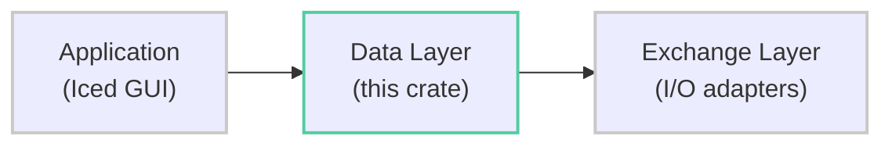
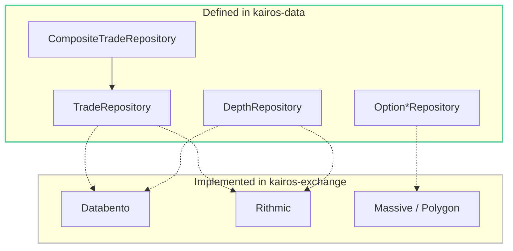
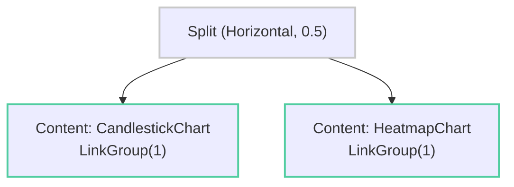

Core data layer for the Kairos futures trading platform. Provides domain models, business logic, state management, and service orchestration with **no I/O operations** — all external data access is abstracted behind repository traits implemented in the `kairos-exchange` crate.

## Architecture


The data layer depends only on domain abstractions. Repository trait definitions live here; concrete implementations (Databento, Rithmic, Massive/Polygon) live in `kairos-exchange`.

<details>
<summary><strong>Module Overview</strong></summary>

| Module | Purpose |
|--------|---------|
| `domain/` | Pure domain models and business logic — `Price`, `Trade`, `Candle`, `DepthSnapshot`, options, GEX, aggregation |
| `repository/` | Async trait definitions for data access (`TradeRepository`, `DepthRepository`, `Option*Repository`) |
| `services/` | Business logic orchestration — market data loading, options access, replay engine, GEX analytics, feed merging, cache management |
| `state/` | Application state persistence, chart state, layout system, pane configuration, replay state |
| `config/` | Theme (HSV/hex utilities), timezone, sidebar, panel configuration |
| `feed/` | `DataFeedManager` — CRUD, capability queries, priority routing |
| `drawing/` | 14 chart annotation tools with serializable state |
| `secrets/` | `SecretsManager` — OS keyring + file fallback + env var lookup |
| `util/` | Formatting, math, time, logging helpers |

</details>

## Domain Models

<details>
<summary><strong>Price (Fixed-Point Arithmetic)</strong></summary>

All price values use `i64` with 10^-8 precision (`PRECISION = 100_000_000`). Never use floating point for prices.

```rust
let price = Price::from_f64(4525.75);
let tick_size = Price::from_f64(0.25);

price.round_to_tick(tick_size);
price.round_to_side_step(tick_size, true);   // floor
price.round_to_side_step(tick_size, false);  // ceil
price.add_steps(4, tick_size);               // +4 ticks
Price::steps_between_inclusive(low, high, tick_size);
```

Implements: `Add`, `Sub`, `Mul<f64>`, `Div<i64>`, `Display`, `Hash`, `Ord`, `Serialize`/`Deserialize`.

</details>

<details>
<summary><strong>Core Value Objects</strong></summary>

| Type | Description |
|------|-------------|
| `Timestamp` | Milliseconds since Unix epoch (`u64` wrapper). Convert via `to_datetime()`, `to_date()` |
| `DateRange` | Inclusive date range with iteration. `last_n_days(7)`, `dates()`, `num_days()` |
| `TimeRange` | Start/end `Timestamp` pair. `contains()`, `duration_millis()` |
| `Side` | Trade aggressor direction: `Buy`, `Sell`, `Bid`, `Ask` |
| `Volume` / `Quantity` | `f64` wrappers with `zero()` and `value()` methods |

</details>

<details>
<summary><strong>Trade, Candle, DepthSnapshot</strong></summary>

**Trade** — individual market trade with timestamp, price, quantity, side.

```rust
let trade = Trade::new(timestamp, price, quantity, Side::Buy);
let trade = Trade::from_raw(1706140800000, 4525.75, 5.0, false); // is_sell=false
```

**Candle** — OHLCV bar with separate buy/sell volume tracking. Asserts `high >= open,close` and `low <= open,close`.

Key methods: `total_volume()`, `volume_delta()`, `is_bullish()`, `body_size()`, `range()`.

**DepthSnapshot** — order book state at a point in time (`BTreeMap<Price, Quantity>` for bids/asks).

Key methods: `best_bid()`, `best_ask()`, `mid_price()`, `spread()`, `total_bid_volume()`, `total_ask_volume()`.

</details>

<details>
<summary><strong>Futures Types</strong></summary>

**FuturesTicker** — fixed-size (28-byte) identifier with embedded venue, product, and optional display name.

```rust
let ticker = FuturesTicker::new("ESH25", FuturesVenue::CMEGlobex);
ticker.product();          // "ES"
ticker.exchange();         // "CME Globex"
ticker.expiration_date();  // Option<NaiveDate>
// Serialization: "CMEGlobex:ESH25" or "CMEGlobex:ESH25|E-mini S&P 500"
```

**FuturesTickerInfo** — ticker + contract specifications (`tick_size`, `min_qty`, `contract_size`).

**Timeframe** — `M1s`..`M30s` (sub-minute), `M1`..`M30`, `H1`, `H4`, `D1`. Predefined sets: `KLINE`, `HEATMAP`.

**ContractType** — `Continuous(u8)` for rolling contracts (`ES.c.0`), `Specific(String)` for named (`ESH25`).

</details>

<details>
<summary><strong>Options Types</strong></summary>

**OptionContract** — strike, expiration, type (Call/Put), exercise style (American/European/Bermudan).

**OptionSnapshot** — full market data snapshot including bid/ask, greeks, IV, and computed values (`mid_price`, `intrinsic_value`, `extrinsic_value`, `is_itm`).

**OptionChain** — collection of snapshots with filtering: `calls()`, `puts()`, `by_expiration()`, `by_strike()`, `atm_strike()`, `with_greeks()`, `with_iv()`.

**GexProfile** — gamma exposure analysis per strike. Key levels, call/put walls, zero gamma level, expected move. Built from `OptionChain` via `GexProfile::from_option_chain()`.

</details>

## Chart Domain

<details>
<summary><strong>ChartConfig, ChartData, ChartBasis</strong></summary>

```rust
let config = ChartConfig {
    ticker: es_ticker,
    basis: ChartBasis::Time(Timeframe::M5), // or ChartBasis::Tick(100)
    date_range: DateRange::last_n_days(7),
    chart_type: ChartType::Candlestick,     // also: Line, HeikinAshi, Heatmap
};

// Trades are PRIMARY source; candles are DERIVED
let data = ChartData::from_trades(trades, candles)
    .with_depth(depth_snapshots)
    .with_gaps(gaps);
```

**LoadingStatus** tracks progress: `Idle` > `Downloading` > `LoadingFromCache` > `Building` > `Ready` | `Error`.

**Indicators** — `KlineIndicator` (Volume, Delta, OI, SMA, EMA, RSI, MACD, Bollinger), `HeatmapIndicator` (Volume, Delta, Trades).

</details>

## Trade Aggregation

Single source of truth for converting raw trades to candles. Two modes:

| Function | Mode | Description |
|----------|------|-------------|
| `aggregate_trades_to_candles` | Time-based | Group trades into fixed-duration buckets |
| `aggregate_trades_to_ticks` | Tick-based | Group trades into fixed-count bars |
| `aggregate_candles_to_timeframe` | Roll-up | Aggregate to higher timeframe without re-fetching |

Validates inputs (non-empty, sorted by time). Buy/sell volume tracked separately through all paths.

## Repository Pattern



<details>
<summary><strong>Trait Details</strong></summary>

**TradeRepository** — `get_trades`, `get_trades_with_progress`, `has_trades`, `get_trades_for_date`, `store_trades`, `find_gaps`, `stats`. Includes Databento-specific extensions for cache coverage, prefetch, and cost estimation.

**DepthRepository** — `get_depth`, `has_depth`, `get_depth_for_date`, `store_depth`, `find_gaps`, `stats`.

**Option Repositories** — three traits following the same pattern:
- `OptionSnapshotRepository` — snapshot CRUD + gap detection
- `OptionChainRepository` — chain queries by date, strike range, expiration
- `OptionContractRepository` — contract CRUD, search, active filtering

**CompositeTradeRepository** — merges trades from multiple feeds with deduplication and gap detection. Partial failures logged as warnings; only fails if all feeds fail.

**RepositoryStats** — `cached_days`, `total_size`, `hit_rate`, `hits`, `misses`, `size_human_readable()`.

</details>

## Services

<details>
<summary><strong>MarketDataService</strong></summary>

Primary service for chart data loading with progress tracking and instant basis switching.

- **Load**: `get_chart_data(&config, &ticker_info)` — trades are PRIMARY, candles DERIVED
- **Rebuild**: `rebuild_chart_data(&trades, basis, &ticker_info)` — instant basis switching, no API calls
- **Download**: `download_to_cache` / `download_to_cache_with_progress` — cache without loading into memory
- **Estimate**: `estimate_data_request` — returns day counts, gaps, cost (Databento)
- **Preview**: `get_trades_for_preview` — cache-only, no remote fetch
- **Status**: `get_loading_status`, `get_all_loading_statuses`, `get_cache_stats`

Heatmap charts are auto-limited to 1 day maximum to prevent memory issues.

</details>

<details>
<summary><strong>OptionsDataService</strong></summary>

Chain access, contract queries, snapshots, and analytics.

- **Chains**: `get_chain_with_greeks`, `get_chains_for_range`, `get_chain_near_atm`, `get_chain_by_expiration`
- **Contracts**: `get_available_contracts`, `get_active_contracts`, `search_contracts`
- **Analytics**: `get_historical_iv`, `get_gex_profile`, `get_gex_profiles`

</details>

<details>
<summary><strong>ReplayEngine</strong></summary>

Historical data replay with playback control and bounded event streaming (channel capacity 1024).

- **Control**: `play`, `pause`, `stop`, `seek`, `jump`, `set_speed`
- **Query**: `get_candles`, `get_trades`, `get_depth`, `get_rebuild_trades`, `compute_volume_histogram`
- **Events**: `DataLoaded`, `MarketData` (incremental), `ChartRebuild` (full), `PositionUpdate`, `PlaybackComplete`, etc.
- **Speed**: `Quarter` (0.25x) through `Hundred` (100x) plus `Custom(f32)`

</details>

<details>
<summary><strong>GexCalculationService</strong></summary>

Stateless gamma exposure analysis. Uses dealer perspective (dealers SHORT options).

**Formula**: `GEX = Gamma * OI * ContractSize * Spot^2 * 0.01` (Kahan summation for stability).

- **Profile**: `calculate_profile`, `try_calculate_profile`
- **Regime**: `determine_market_regime` — Positive (>1M), Negative (<-1M), Neutral
- **Levels**: `find_zero_gamma_level`, `nearest_resistance_above`, `nearest_support_below`, `calculate_expected_range`
- **Detection**: `has_squeeze_potential` (OI >10k, gamma >500k, price <2% from strike)
- **Skew**: `analyze_gamma_skew` — Bullish (ratio >1.5), Bearish (<0.67), Neutral

</details>

<details>
<summary><strong>Other Services</strong></summary>

**Feed Merger** (`merge_segments`) — sorts by feed priority, deduplicates within 1ms tolerance at same price, detects gaps >5 seconds.

**CacheManagerService** — trade/depth stats, combined stats, cache status checks, human-readable summary.

</details>

## State Management

<details>
<summary><strong>AppState (Persisted)</strong></summary>

Serialized to versioned JSON with automatic migration on load. Backs up corrupted files to `_backup_{timestamp}.json`.

| Field | Type |
|-------|------|
| `layout_manager` | `LayoutManager` — multiple named layouts |
| `selected_theme` / `custom_theme` | Theme configuration |
| `main_window` | `WindowSpec` — position and size |
| `timezone` | `UserTimezone` (UTC / Local) |
| `sidebar` | Position, date range preset, active menu |
| `scale_factor` | `ScaleFactor` (clamped 0.8 - 1.5) |
| `data_feeds` | `DataFeedManager` |
| `downloaded_tickers` | `DownloadedTickersRegistry` |
| `databento_config` / `massive_config` | Provider-specific settings |

State file location: `$KAIROS_DATA_PATH/` or platform data dir via `dirs_next::data_dir()`.

Migrations run automatically when `version < CURRENT`. Current: v1 > v2 (adds DataFeedManager from legacy config).

</details>

<details>
<summary><strong>ChartState (In-Memory Only)</strong></summary>

Per-chart state holding config, data, and loading status.

- `set_data(chart_data)` — sets status to Ready
- `append_live_trade(trade)` — updates latest candle in-place (handles time-based and tick-based)
- `is_loaded()`, `is_loading()`, `trade_count()`, `candle_count()`, `clear_data()`

</details>

<details>
<summary><strong>Layout System</strong></summary>

Pane trees use a composite pattern: `Split` nodes contain two children; `Content` leaves hold content.



**ContentKind**: `Starter`, `HeatmapChart`, `CandlestickChart`, `TimeAndSales`, `Ladder`, `ComparisonChart`.

**LinkGroup** (1-9) synchronizes ticker/date changes across panes. **Dashboard** = root pane + popout windows. **LayoutManager** manages multiple named layouts.

</details>

<details>
<summary><strong>Pane Settings</strong></summary>

Each `Settings` holds a `VisualConfig` enum wrapping type-specific configs:

| Config | Key Fields |
|--------|-----------|
| `KlineConfig` | `show_volume`, `candle_style` (bull/bear colors), `footprint` |
| `HeatmapConfig` | `trade_size_filter`, `order_size_filter`, `rendering_mode` (Sparse/Dense/Auto), `max_trade_markers` |
| `TimeAndSalesConfig` | `max_rows`, `show_delta`, `stacked_bar`, `trade_retention_secs` |
| `LadderConfig` | `levels`, `show_spread`, `show_chase_tracker`, `trade_retention_secs` |
| `ComparisonConfig` | `normalize`, per-ticker `colors` and `names` |

Plus `drawings: Vec<SerializableDrawing>` and `studies: Vec<StudyInstanceConfig>` per pane.

</details>

<details>
<summary><strong>Replay State</strong></summary>

**PlaybackStatus**: `Stopped`, `Playing`, `Paused`.

**SpeedPreset**: `Quarter` (0.25x), `Half`, `Normal`, `Double`, `Five`, `Ten`, `TwentyFive`, `Fifty`, `Hundred`, `Custom(f32)`.

**ReplayData** — `BTreeMap`-indexed for efficient windowed access: `trades_in_window`, `trades_after`, `depth_at`, `next_trades`. Includes candle caching.

</details>

## Data Feed Management

<details>
<summary><strong>DataFeedManager</strong></summary>

Priority-based multi-feed manager with capability routing. Lower priority number = higher preference.

| Provider | Default Priority | Capabilities |
|----------|-----------------|-------------|
| Databento | 10 | HistoricalTrades, HistoricalDepth, HistoricalOHLCV |
| Rithmic | 5 | HistoricalTrades, HistoricalDepth, RealtimeTrades, RealtimeDepth, RealtimeQuotes |

Key methods: `feeds_with_capability`, `primary_feed_for`, `has_connected_provider`, `feeds_by_priority`.

**FeedStatus**: `Disconnected`, `Connecting`, `Connected`, `Error(String)`, `Downloading { current_day, total_days }`.

</details>

## Secrets Management

<details>
<summary><strong>SecretsManager</strong></summary>

Lookup hierarchy: OS keyring > file (base64) > env var > `NotConfigured`.

| Provider | Env Var | Keyring Service |
|----------|---------|----------------|
| Databento | `DATABENTO_API_KEY` | `kairos` |
| Massive | `MASSIVE_API_KEY` | `kairos` |
| Rithmic | `RITHMIC_PASSWORD` | `kairos` |

Validation on store: non-empty, >= 10 chars. File backup at `{data_dir}/secrets/{provider}.key` (base64, obfuscation only).

</details>

## Error Handling

All error types implement the `AppError` trait: `user_message()`, `is_retriable()`, `severity()`.

<details>
<summary><strong>Error Hierarchy</strong></summary>

| Type | Variants | Used By |
|------|----------|---------|
| `DataError` | Service, Repository, State | Top-level crate error |
| `ServiceError` | Repository, Aggregation, InvalidConfig, NoData | MarketDataService |
| `RepositoryError` | NotFound, AccessDenied, RateLimit, Cache, Remote, Serialization, Io, InvalidData | Repository traits |
| `AggregationError` | NoTrades, InvalidTimeframe, InvalidTickCount, UnsortedTrades | Aggregation functions |
| `PersistenceError` | Io, Serialization, InvalidPath, Migration | State persistence |
| `CacheManagerError` | Repository, InvalidOperation | CacheManagerService |
| `SecretsError` | KeyringAccess, StoreFailed, DeleteFailed, InvalidKey | SecretsManager |

Retriable: `RepositoryError::RateLimit`, `Remote`, `Io`.

</details>

## Panel Domain Logic

<details>
<summary><strong>Depth Grouping, Chase Tracker, Trade Aggregator</strong></summary>

**Depth Grouping** — side-biased rounding for orderbook levels. Bids floor, asks ceil to prevent price level overlap.

**Chase Tracker** — state machine tracking consecutive best bid/ask movements (`Idle` > `Chasing` > `Fading` > `Idle`). Returns `(start_price, end_price, alpha)` where alpha is opacity based on consecutive count.

**Trade Aggregator** — accumulates trade metrics (count, volume, average size) with sliding window support via `add_trade` / `remove_trade`.

</details>

## Drawing Types

<details>
<summary><strong>Chart Annotations</strong></summary>

14 drawing tools organized by required anchor points:

| Points | Tools |
|--------|-------|
| 0 | None (selection/pan mode) |
| 1 | HorizontalLine, VerticalLine, TextLabel, PriceLabel |
| 2 | Line, Ray, ExtendedLine, FibRetracement, Rectangle, Ellipse, Arrow, PriceRange, DateRange |
| 3 | FibExtension, ParallelChannel |

Each `SerializableDrawing` has: `id` (UUID), `tool`, `points`, `style` (stroke, fill, line style, labels), `visible`, `locked`. Fibonacci levels default to 0%, 23.6%, 38.2%, 50%, 61.8%, 78.6%, 100%.

</details>

## Configuration

<details>
<summary><strong>Theme, Timezone, Sidebar</strong></summary>

**Theme** — default "Kairos" (`#181616` bg, `#C5C9C5` text, `#51CDA0` success, `#C0504D` danger). Includes HSV/hex color utilities: `hex_to_color`, `color_to_hex`, `darken`, `lighten`, `to_hsva`, `from_hsva`.

**UserTimezone** — `Utc` (default) or `Local`. Adaptive formatting for timestamps, crosshairs, and replay display.

**Sidebar** — `Position` (Left/Right), `Menu` (Layout, Connections, DataFeeds, Settings, ThemeEditor, Replay), `DateRangePreset` (1d, 2d, 1w, 2w, 1mo).

**ScaleFactor** — `f32` clamped to [0.8, 1.5].

</details>

## Utilities

<details>
<summary><strong>Formatting, Math, Time</strong></summary>

**Formatting** — `abbr_large_numbers` ("1.50m"), `currency_abbr` ("$1.5m"), `format_with_commas`, `pct_change` ("+2.50%").

**Math** — `round_to_tick`, `round_to_next_tick` (floor/ceil), `guesstimate_ticks`, `calc_panel_splits`.

**Time** — constants (`DAY_MS`, `HOUR_MS`, etc.), `format_duration_ms` ("1d 1h"), date reset utilities, `ok_or_default` serde helper.

**Logging** — `kairos_data::util::logging::path()` resolves log file path.

**Top-level** — `data_path(subdir)`, `open_data_folder()`, `lock_or_recover(&mutex)`.

</details>

## Environment Variables

| Variable | Purpose |
|----------|---------|
| `KAIROS_DATA_PATH` | Override data directory (default: platform data dir) |
| `DATABENTO_API_KEY` | Databento API key (env fallback) |
| `MASSIVE_API_KEY` | Polygon/Massive API key (env fallback) |
| `RITHMIC_PASSWORD` | Rithmic password (env fallback) |
| `RUST_LOG` | Logging level (e.g. `kairos_data=debug`) |

## Dependencies

<details>
<summary><strong>Dependency List</strong></summary>

| Crate | Purpose |
|-------|---------|
| `serde`, `serde_json` | Serialization |
| `chrono` | Date/time |
| `iced_core` | Color types (Iced UI framework) |
| `palette` | Color space conversions |
| `enum-map`, `rustc-hash` | Efficient collections |
| `uuid` | Feed/drawing identifiers |
| `thiserror` | Error derive macros |
| `async-trait` | Async trait definitions |
| `tokio` | Async runtime (sync, macros, rt-multi-thread, time) |
| `keyring` | OS credential store access |
| `base64` | Secret file encoding |
| `log` | Logging facade |
| `dirs-next` | Platform data directory resolution |
| `open` | Open file browser |

</details>

## Testing

```bash
cargo test --package kairos-data            # All tests
cargo test --package kairos-data -- domain  # Domain tests only
cargo clippy --package kairos-data          # Lint
cargo fmt --check                           # Format check
```

## License

GPL-3.0-or-later
