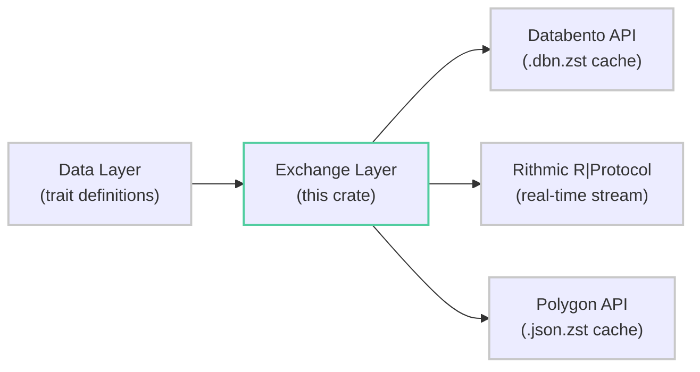
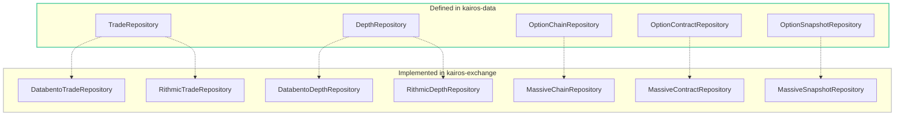

I/O adapter and repository layer for the Kairos futures trading platform. Provides concrete implementations of data-layer repository traits by connecting to external market data providers — **Databento** (historical CME futures), **Rithmic** (real-time CME futures streaming), and **Massive/Polygon** (US equity options). All network I/O, caching, rate limiting, and protocol translation lives here.

## Architecture


Repository trait definitions live in `kairos-data`; this crate provides the concrete implementations that perform actual I/O.

<details>
<summary><strong>Module Overview</strong></summary>

| Module | Purpose |
|--------|---------|
| `adapter/databento/` | CME Globex historical futures — Databento API client, fetcher, per-day caching, DBN decoding |
| `adapter/rithmic/` | CME Globex real-time streaming — Rithmic ticker/history plant connections, message mapping |
| `adapter/massive/` | US equity options — Polygon Massive API client, rate limiting, JSON.zst caching |
| `adapter/error.rs` | `AdapterError` — fetch, parse, connection, invalid request variants |
| `adapter/event.rs` | `Event` enum — historical + live events (depth, kline, trade, connect/disconnect) |
| `adapter/stream.rs` | `StreamKind`, `PersistStreamKind`, `ResolvedStream`, `UniqueStreams` — stream configuration and deduplication |
| `repository/databento/` | `DatabentoTradeRepository`, `DatabentoDepthRepository` — cached historical futures |
| `repository/rithmic/` | `RithmicTradeRepository`, `RithmicDepthRepository` — real-time and historical tick data |
| `repository/massive/` | `MassiveChainRepository`, `MassiveContractRepository`, `MassiveSnapshotRepository` — options data |
| `types.rs` | Exchange-specific market data types: `Trade`, `Kline`, `Depth`, `OpenInterest`, `TickerInfo` |
| `util.rs` | Fixed-point `Price` / `PriceStep` arithmetic, `Power10` generic, timestamp conversion |
| `error.rs` | Top-level `Error` enum with `AppError` trait + `error!` macro |

</details>

## Adapters

Three provider adapters, each with its own client, fetcher, mapper, and cache layer.

<details>
<summary><strong>Databento (Historical Futures)</strong></summary>

Fetches historical CME Globex market data via the Databento API. Supports OHLCV, trades, MBP-10 depth, and open interest schemas with intelligent per-day caching in `.dbn.zst` format.

```rust
let config = DatabentoConfig::from_secrets()?;  // OS keyring → file → env var
let mut manager = HistoricalDataManager::new(config).await?;

// Cached trade fetch with progress
let trades = manager.fetch_trades_cached_with_progress(
    "ES.c.0",
    (start, end),
    |done, total, day, from_cache| { /* update UI */ },
).await?;

// Cached depth fetch (MBP-10)
let depth = manager.fetch_mbp10_cached("ES.c.0", (start, end)).await?;

// OHLCV with automatic timeframe aggregation
let candles = manager.fetch_ohlcv("NQ.c.0", Timeframe::M5, (start, end)).await?;
```

**Supported Continuous Contracts:**

| Symbol | Instrument | Tick Size | Multiplier |
|--------|-----------|-----------|------------|
| `ES.c.0` | E-mini S&P 500 | 0.25 | 50 |
| `NQ.c.0` | E-mini Nasdaq-100 | 0.25 | 20 |
| `YM.c.0` | E-mini Dow | 1.0 | 5 |
| `RTY.c.0` | E-mini Russell 2000 | 0.1 | 50 |
| `ZN.c.0` | 10-Year T-Note | 0.015625 | 1000 |
| `ZB.c.0` | 30-Year T-Bond | 0.03125 | 1000 |
| `ZT.c.0` | 2-Year T-Note | 0.0078125 | 2000 |
| `ZF.c.0` | 5-Year T-Note | 0.0078125 | 1000 |
| `GC.c.0` | Gold | 0.10 | 100 |
| `SI.c.0` | Silver | 0.005 | 5000 |
| `CL.c.0` | Crude Oil | 0.01 | 1000 |
| `NG.c.0` | Natural Gas | 0.001 | 10000 |

**Configuration:**

```rust
pub struct DatabentoConfig {
    pub api_key: String,
    pub dataset: Dataset,              // Default: GlbxMdp3 (CME Globex)
    pub cache_enabled: bool,           // Default: true
    pub cache_max_days: u32,           // Default: 90
    pub auto_backfill: bool,           // Default: false
    pub cache_dir: PathBuf,
    pub warn_on_expensive_calls: bool, // Default: true
}
```

**Cost Awareness:**

| Schema | Cost (1-10) | Description |
|--------|------------|-------------|
| MBO | 10 | Very expensive — full order-by-order |
| MBP-10 | 3 | Moderate — 10-level book snapshots |
| Trades | 2 | Low — trade executions only |
| OHLCV | 1 | Very cheap — 1-minute bars |

**Cache Structure:**
```
cache/databento/
└── ES-c-0/
    ├── ohlcv1m/
    │   └── 2024-01-15.dbn.zst
    ├── trades/
    │   └── 2024-01-15.dbn.zst
    └── mbp10/
        └── 2024-01-15.dbn.zst
```

**Fetch Workflow:**
1. Identify cached days (per-day granularity)
2. Find gaps (consecutive uncached date ranges)
3. Fetch each gap from Databento API
4. Save each day individually as `.dbn.zst`
5. Load all days from cache
6. Filter to exact datetime range
7. Aggregate OHLCV to target timeframe if needed

</details>

<details>
<summary><strong>Rithmic (Real-Time Futures)</strong></summary>

Real-time CME Globex streaming via the Rithmic R|Protocol. Connects to ticker and history plants for live market data and historical tick replay.

```rust
let (config, rithmic_config) = RithmicConfig::from_feed_config(&feed, &password)?;
let mut client = RithmicClient::new(config, status_tx);

client.connect(rithmic_config).await?;
client.subscribe("ESH25", "CME").await?;

// Take handle for streaming
let handle = client.take_ticker_handle().unwrap();
let stream = RithmicStream::new(handle);
stream.run(stream_kind, event_tx).await;
```

**Configuration:**

```rust
pub struct RithmicConfig {
    pub env: RithmicEnv,                  // Demo / Live / Test
    pub connect_strategy: ConnectStrategy,
    pub auto_reconnect: bool,             // Default: true
    pub cache_dir: PathBuf,
}
```

**Client Methods:**

| Method | Description |
|--------|-------------|
| `connect(config)` | Connect and authenticate ticker + history plants |
| `subscribe(symbol, exchange)` | Subscribe to real-time market data |
| `unsubscribe(symbol, exchange)` | Unsubscribe from symbol |
| `get_front_month(symbol, exchange)` | Get front-month contract for rolling futures |
| `load_ticks(symbol, exchange, start, end)` | Historical tick data via history plant |
| `disconnect()` | Graceful disconnect |

**Streaming Events:**

The `RithmicStream` loop receives `RithmicMessage` types and converts them:
- `LastTrade` → `Event::TradeReceived` (aggressor: 1=Buy, 2=Sell)
- `BestBidOffer` → `Event::DepthReceived` (BBO only)
- `OrderBook` → `Event::DepthReceived` (multi-level)
- `ConnectionError` / `HeartbeatTimeout` → `Event::ConnectionLost`

**Timestamp Conversion:**
```
ssboe (seconds since epoch) + usecs (microsecond offset)
→ time_ms = ssboe * 1000 + (usecs + 500) / 1000
```

</details>

<details>
<summary><strong>Massive / Polygon (Options Data)</strong></summary>

US equity options data via the Polygon Massive API. Provides option chains, contract metadata, and market snapshots with rate limiting and compressed caching.

```rust
let config = MassiveConfig::from_secrets()?;
let manager = HistoricalOptionsManager::new(config).await?;

// Fetch option chain for a single day
let chain = manager.fetch_option_chain("AAPL", date).await?;

// Fetch chains for a date range (with gap detection)
let chains = manager.fetch_option_chains("SPY", &date_range).await?;

// Single contract snapshot
let snapshot = manager.fetch_contract_snapshot("O:AAPL240119C00150000", date).await?;

// Contract metadata
let contracts = manager.fetch_contracts_metadata("AAPL").await?;
```

**Configuration:**

```rust
pub struct MassiveConfig {
    pub api_key: String,
    pub cache_enabled: bool,           // Default: true
    pub cache_max_days: u32,           // Default: 90
    pub cache_dir: PathBuf,
    pub rate_limit_per_minute: u32,    // Default: 5
    pub timeout_secs: u64,             // Default: 30
    pub max_retries: u32,              // Default: 3
    pub retry_delay_ms: u64,           // Default: 1000
}
```

**Contract Ticker Format:**
```
O:AAPL240119C00150000
├─ O:         prefix
├─ AAPL       underlying ticker
├─ 240119     expiration (YYMMDD)
├─ C          call (or P for put)
└─ 00150000   strike price (8-digit fixed format)
```

**API Endpoints:**

| Endpoint | Purpose |
|----------|---------|
| `GET /v3/snapshot/options/{underlying}` | All option chains for ticker |
| `GET /v3/snapshot/options/{underlying}/{contract}` | Single contract snapshot |
| `GET /v3/reference/options/contracts?underlying_ticker={ticker}` | Contract metadata |

**Rate Limiting:** Built-in `RateLimiter` tracks requests within a sliding window. Automatically waits when limit is reached. Handles HTTP 429 responses with retry.

**Cache Structure:**
```
cache/massive/
├── chains/
│   └── AAPL/
│       └── 2024-01-15.json.zst
├── snapshots/
│   └── AAPL/
│       └── 2024-01-15.json.zst
└── contracts/
    └── AAPL/
        └── metadata.json.zst
```

</details>

## Streaming & Events

<details>
<summary><strong>Event, StreamKind, ResolvedStream</strong></summary>

**Event** — unified event type for all adapter output:

```rust
pub enum Event {
    // Historical data
    HistoricalDepth(u64, Arc<Depth>, Box<[Trade]>),
    HistoricalKline(Kline),

    // Connection lifecycle
    Connected(FuturesVenue),
    Disconnected(FuturesVenue, String),
    ConnectionLost,

    // Live data
    DepthReceived(StreamKind, u64, Arc<Depth>, Box<[Trade]>),
    KlineReceived(StreamKind, Kline),
    TradeReceived(StreamKind, Trade),
}
```

**StreamKind** — runtime stream configuration (with resolved `FuturesTickerInfo`):

```rust
pub enum StreamKind {
    Kline { ticker_info: FuturesTickerInfo, timeframe: Timeframe },
    DepthAndTrades { ticker_info: FuturesTickerInfo, depth_aggr: StreamTicksize, push_freq: PushFrequency },
}
```

**PersistStreamKind** — serializable counterpart for layout persistence:

```rust
pub enum PersistStreamKind {
    Kline(PersistKline),             // ticker + timeframe
    DepthAndTrades(PersistDepth),    // ticker + depth aggregation + push frequency
}
```

**ResolvedStream** — two-phase resolution from serialized config to runtime:

```rust
pub enum ResolvedStream {
    Waiting(Vec<PersistStreamKind>),  // Not yet resolved (missing ticker info)
    Ready(Vec<StreamKind>),           // Runtime-ready
}
```

**UniqueStreams** — deduplicates streams across multiple panes:

```rust
let mut streams = UniqueStreams::from(pane_streams.into_iter());
streams.depth_streams();  // Vec<(TickerInfo, Ticksize, PushFrequency)>
streams.kline_streams();  // Vec<(TickerInfo, Timeframe)>
```

</details>

## Repository Implementations

Concrete implementations of traits defined in `kairos-data/src/repository/traits.rs`.



<details>
<summary><strong>Databento Repositories</strong></summary>

**DatabentoTradeRepository** — cached historical trade data with progress reporting and Databento-specific extensions.

```rust
let repo = DatabentoTradeRepository::new(config).await?;

// Standard trait methods
let trades = repo.get_trades(&ticker, &date_range).await?;
let has = repo.has_trades(&ticker, date).await?;
let gaps = repo.find_gaps(&ticker, &date_range).await?;

// Databento-specific extensions
let coverage = repo.check_cache_coverage_databento(&ticker, schema, &range).await?;
let downloaded = repo.prefetch_to_cache_databento(&ticker, schema, &range).await?;
let cost_usd = repo.get_actual_cost_databento(&ticker, schema, &range).await?;
let symbols = repo.list_cached_symbols_databento().await?;
```

Databento-specific methods (default implementations return errors for non-Databento repos):

| Method | Purpose |
|--------|---------|
| `check_cache_coverage_databento` | Report cached vs uncached days for a schema |
| `prefetch_to_cache_databento` | Download missing days without loading into memory |
| `prefetch_to_cache_databento_with_progress` | Prefetch with `(processed, total)` callback |
| `get_actual_cost_databento` | Query real Databento API for USD cost estimate |
| `list_cached_symbols_databento` | List all symbols with cached data |

**DatabentoDepthRepository** — MBP-10 depth with adaptive decimation to prevent UI freezes.

Decimation thresholds:

| Snapshots | Keep Every Nth | Reduction |
|-----------|---------------|-----------|
| 200K+ | 50th | ~98% |
| 100K-200K | 30th | ~97% |
| 50K-100K | 15th | ~93% |
| 10K-50K | 5th | ~80% |
| < 10K | all | 0% |

</details>

<details>
<summary><strong>Rithmic Repositories</strong></summary>

**RithmicTradeRepository** — historical tick replay and real-time trade data.

```rust
let repo = RithmicTradeRepository::new(client.clone(), "CME");
let trades = repo.get_trades(&ticker, &date_range).await?;
```

- `has_trades()` always returns `true` (assumes available if connected)
- `find_gaps()` returns empty (no caching layer)
- `store_trades()` is a no-op (read-only)

**RithmicDepthRepository** — placeholder for future historical depth support.

- All depth queries return `NotFound` — depth is available via real-time streaming only
- `has_depth()` always returns `false`

</details>

<details>
<summary><strong>Massive Repositories</strong></summary>

**MassiveChainRepository** — option chain queries with strike/expiration filtering.

```rust
let repo = MassiveChainRepository::new(config).await?;
let chain = repo.get_chain("AAPL", date).await?;
let filtered = repo.get_chain_by_strike_range("SPY", date, 440.0, 460.0).await?;
let by_exp = repo.get_chain_by_expiration("AAPL", date, expiration).await?;
```

**MassiveContractRepository** — contract metadata, search, and filtering.

```rust
let repo = MassiveContractRepository::new(config).await?;
let all = repo.get_contracts("AAPL").await?;
let active = repo.get_active_contracts("AAPL", today).await?;
let contract = repo.get_contract("O:AAPL240119C00150000").await?;
let results = repo.search_contracts(
    Some("SPY"), Some(expiration), Some(400.0), Some(500.0), false
).await?;
```

**MassiveSnapshotRepository** — market data snapshots with partial failure tolerance.

```rust
let repo = MassiveSnapshotRepository::new(config).await?;
let snapshots = repo.get_snapshots("AAPL", &date_range).await?;
let snapshot = repo.get_snapshot("O:AAPL240119C00150000", date).await?;
```

`get_snapshots_for_contracts()` continues on individual failures — logs warnings but returns all successful fetches.

</details>

## Exchange Types

<details>
<summary><strong>Trade, Kline, Depth, OpenInterest</strong></summary>

**Trade** — individual market trade execution:

```rust
pub struct Trade {
    pub time: u64,        // Milliseconds since epoch
    pub price: f32,
    pub qty: f32,
    pub side: TradeSide,  // Buy | Sell
}
```

**Kline** — OHLCV candle with separate buy/sell volume:

```rust
pub struct Kline {
    pub time: u64,
    pub open: f32,
    pub high: f32,
    pub low: f32,
    pub close: f32,
    pub volume: f32,
    pub buy_volume: f32,
    pub sell_volume: f32,
}
```

**Depth** — order book snapshot with `BTreeMap<i64, f32>` for bids/asks (price units → quantity):

```rust
let depth = Depth::new(timestamp);
depth.update_bid(price, qty);       // Insert if qty > 0, remove if 0
depth.best_bid();                    // Option<(Price, f32)>
depth.best_ask();                    // Option<(Price, f32)>
depth.top_bids(10);                  // Vec<(Price, f32)> — highest first
depth.top_asks(10);                  // Vec<(Price, f32)> — lowest first
```

**OpenInterest** — open interest snapshot:

```rust
pub struct OpenInterest {
    pub time: u64,
    pub open_interest: f32,
}
```

**TickerInfo** — ticker metadata with contract specifications:

```rust
let info = TickerInfo::new(ticker, 0.25, 1.0, 50.0);
info.to_domain();        // → FuturesTickerInfo
info.market_type();      // → "futures"
info.exchange();         // → FuturesVenue
```

</details>

## Fixed-Point Arithmetic

<details>
<summary><strong>Price, PriceStep, Power10</strong></summary>

**Price** — `i64` with 10^-8 precision. Same representation as `kairos_data::Price` — zero-cost conversion between layers.

```rust
let price = Price::from_f32(4525.75);
price.round_to_step(step);                      // Round to nearest step
price.floor_to_step(step);                       // Floor to step
price.ceil_to_step(step);                        // Ceil to step
price.round_to_side_step(is_sell_or_bid, step);  // Side-biased rounding
price.add_steps(4, step);                        // +4 step increments
Price::steps_between_inclusive(low, high, step);  // Count steps in range
```

**PriceStep** — step size in atomic units:

```rust
let step = PriceStep::from_f32_lossy(0.25);  // ES tick size
step.to_f32_lossy();                           // → 0.25
```

**Power10** — generic power-of-10 type with compile-time bounds:

```rust
type MinTicksize = Power10<-8, 2>;     // 10^-8 to 10^2
type ContractSize = Power10<-4, 6>;    // 10^-4 to 10^6
type MinQtySize = Power10<-6, 8>;      // 10^-6 to 10^8
```

</details>

## Error Handling

<details>
<summary><strong>Error Hierarchy</strong></summary>

**Top-Level Error** — unified exchange error with `AppError` trait:

| Variant | Retriable | Severity | Description |
|---------|-----------|----------|-------------|
| `Fetch(String)` | Yes | Recoverable | API/network errors |
| `Parse(String)` | No | Warning | Malformed responses |
| `Config(String)` | No | Critical | Missing API keys, invalid settings |
| `Cache(String)` | No | Warning | I/O failures, corruption |
| `Symbol(String)` | No | Info | Not found, invalid format |
| `Validation(String)` | No | Info | Missing fields, out of range |
| `Databento(Error)` | Yes | Recoverable | Databento API errors |
| `Dbn(Error)` | No | Critical | Corrupted/incompatible data |
| `Rithmic(Error)` | Yes | Recoverable | Rithmic protocol errors |
| `Io(Error)` | Yes | Recoverable | File system errors |

**Convenience Macro:**

```rust
use kairos_exchange::error;

return Err(error!(fetch: "API returned {}", status));
return Err(error!(config: "Missing API key for {}", provider));
return Err(error!(symbol: "{} not found", ticker));
```

**Adapter-Level Errors:**

| Type | Variants |
|------|----------|
| `AdapterError` | `FetchError`, `ParseError`, `InvalidRequest`, `ConnectionError` |
| `DatabentoError` | `Api`, `Dbn`, `SymbolNotFound`, `InvalidInstrumentId`, `Cache`, `Config` |
| `RithmicError` | `Connection`, `Auth`, `Subscription`, `Data`, `Config` |
| `MassiveError` | `Api`, `Http`, `RateLimit`, `Parse`, `Cache`, `SymbolNotFound`, `InvalidContractTicker`, `Config`, `Io`, `Json`, `DateTime`, `InvalidData`, `Timeout`, `Auth` |

</details>

## Type Conversions

<details>
<summary><strong>Price, Timestamp, Side Mapping</strong></summary>

**Price Conversions:**

| Source | Precision | Conversion |
|--------|-----------|------------|
| Databento | 10^-9 (i64) | Divide by 10 → domain 10^-8 |
| Rithmic | f64 | `Price::from_f64()` |
| Massive | f64 | `Price::from_f64()` |
| Exchange `Price` ↔ Data `Price` | Both 10^-8 (i64) | Zero-cost `From` impl |

**Timestamp Conversions:**

| Source | Format | Conversion |
|--------|--------|------------|
| Databento `ts_event` | Nanoseconds | `÷ 1_000_000` → milliseconds |
| Rithmic `ssboe + usecs` | Seconds + microseconds | `ssboe * 1000 + (usecs + 500) / 1000` |
| Massive `last_updated` | Nanoseconds | `÷ 1_000_000` → milliseconds |

**Side / Aggressor Mapping:**

| Source | Buy | Sell |
|--------|-----|------|
| Databento | `Side::Bid` | `Side::Ask` |
| Rithmic | aggressor = `1` | aggressor = `2` |

</details>

## Provider Comparison

| Aspect | Databento | Rithmic | Massive |
|--------|-----------|---------|---------|
| **Data** | Historical futures | Real-time futures | Options data |
| **Source** | Databento API | Rithmic R\|Protocol | Polygon API |
| **Schemas** | OHLCV, Trades, MBP-10 | Streaming messages | JSON snapshots |
| **Caching** | Per-day `.dbn.zst` | None | Per-day `.json.zst` |
| **Rate Limiting** | Implicit (API limits) | Connection-based | Explicit (5 req/min) |
| **Cost Model** | Per-schema (1-10 scale) | Monthly subscription | Per-request |
| **Retries** | 3 on transient errors | Built-in reconnect | 3 + exponential backoff |

## Environment Variables

| Variable | Purpose |
|----------|---------|
| `DATABENTO_API_KEY` | Databento API key (env fallback) |
| `MASSIVE_API_KEY` | Polygon/Massive API key (env fallback) |
| `RITHMIC_PASSWORD` | Rithmic password (env fallback) |
| `KAIROS_DATA_PATH` | Override data/cache directory |

## Dependencies

<details>
<summary><strong>Dependency List</strong></summary>

| Crate | Purpose |
|-------|---------|
| `databento` | Databento API client and DBN format decoding |
| `rithmic-rs` | Rithmic R\|Protocol client (ticker/history plants) |
| `reqwest` | HTTP client for Polygon API (with `rustls-tls`) |
| `zstd` | Zstandard compression for Massive cache files |
| `tokio` | Async runtime (rt, macros, fs) |
| `async-trait` | Async trait support |
| `serde`, `serde_json` | Serialization |
| `chrono` | Date/time handling |
| `time` | Timestamp conversions (macros, formatting, parsing) |
| `dirs-next` | Cross-platform directory paths |
| `toml` | Configuration parsing |
| `thiserror` | Error derive macros |
| `rustc-hash` | Fast hashing for stream deduplication |
| `log` | Logging facade |
| `kairos-data` | Domain types and repository trait definitions |

</details>

## Testing

```bash
cargo test --package kairos-exchange            # All tests
cargo test --package kairos-exchange -- massive  # Options tests only
cargo clippy --package kairos-exchange           # Lint
cargo fmt --check                                # Format check
```

## License

GPL-3.0-or-later
