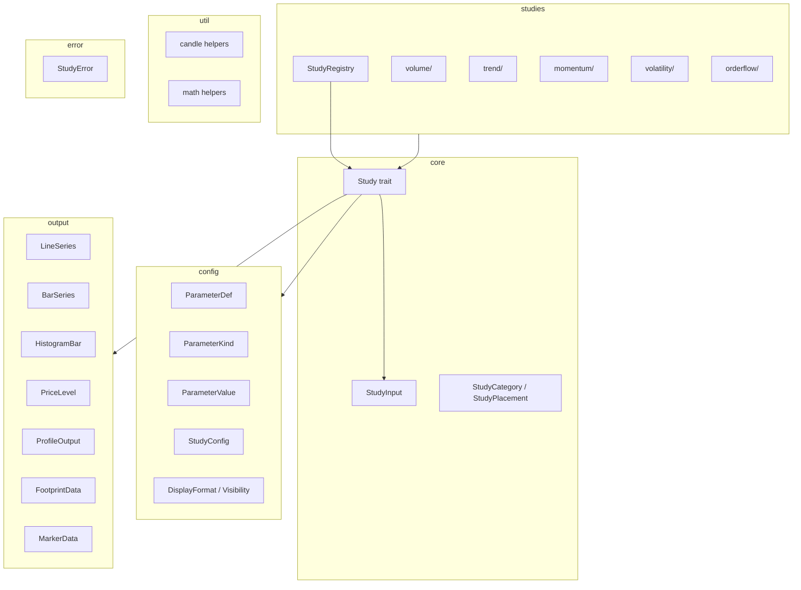
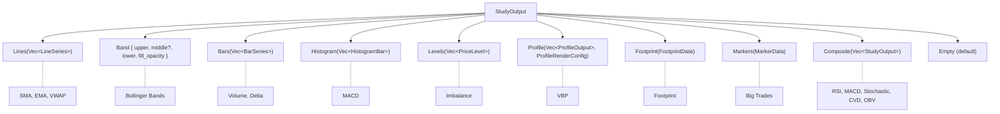
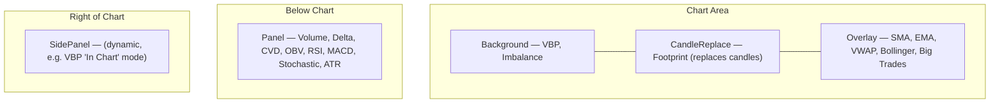

# kairos-study

Technical studies and indicators for Kairos charts.

| | |
|---|---|
| Version | `0.1.0` |
| License | GPL-3.0-or-later |
| Edition | 2024 |
| Depends on | `kairos-data` 0.2.0 |

## Overview

`kairos-study` provides a trait-based computation system that transforms market data (candles and
trades) into abstract render primitives — lines, bars, bands, histograms, profiles, footprints,
and markers. Sixteen built-in studies cover volume, trend, momentum, volatility, and order flow
analysis. New studies can be added by implementing a single trait and registering a factory
closure.

This crate is a pure computation library. It has no GUI dependency, no network I/O, and no
filesystem access. The chart rendering layer in the `app` crate converts the output primitives
into canvas draw calls. `kairos-study` concerns itself only with data in, primitives out.

## Architecture

### Data flow


### Module structure



## Module Structure

```text
src/
├── lib.rs                  Root re-exports and BULLISH/BEARISH color constants
├── prelude.rs              Convenience glob-import for study implementations
├── error.rs                StudyError with AppError impl
├── config/
│   ├── parameter.rs        ParameterDef, ParameterKind, ParameterTab, ParameterSection
│   ├── value.rs            ParameterValue, LineStyleValue
│   ├── store.rs            StudyConfig (HashMap-backed runtime config)
│   └── display.rs          DisplayFormat, Visibility (conditional UI logic)
├── core/
│   ├── study.rs            Study trait (14 methods, Send + Sync bound)
│   ├── input.rs            StudyInput (5 fields, all borrowed)
│   └── metadata.rs         StudyCategory (6 variants), StudyPlacement (5 variants)
├── output/
│   ├── mod.rs              StudyOutput enum (10 variants)
│   ├── series.rs           LineSeries, BarSeries, BarPoint, HistogramBar, PriceLevel
│   ├── markers.rs          TradeMarker, MarkerData, MarkerRenderConfig, MarkerShape
│   ├── footprint/
│   │   ├── data.rs         FootprintData, FootprintCandle, FootprintLevel
│   │   ├── render.rs       CandleRenderConfig, mode/data-type/position/grouping enums
│   │   └── scaling.rs      FootprintScaling (6 strategies)
│   └── profile/
│       ├── types.rs        ProfileLevel, ProfileSide, VolumeNode, ExtendDirection
│       └── vbp.rs          VbpPocConfig, VbpValueAreaConfig, VbpNodeConfig, VbpVwapConfig
├── studies/
│   ├── mod.rs              StudyRegistry, StudyInfo, re-exports
│   ├── registry.rs         register_built_ins() — 16 study registrations
│   ├── volume/             VolumeStudy, DeltaStudy, CvdStudy, ObvStudy
│   ├── trend/              SmaStudy, EmaStudy, VwapStudy
│   ├── momentum/           RsiStudy, MacdStudy, StochasticStudy
│   ├── volatility/         AtrStudy, BollingerStudy
│   └── orderflow/          FootprintStudy, VbpStudy, BigTradesStudy, ImbalanceStudy
└── util/
    ├── candle.rs            source_value() (7 sources), candle_key()
    └── math.rs              mean(), variance(), standard_deviation()
```

---

## Study Trait

All studies implement `Study: Send + Sync` (defined in `src/core/study.rs`). The trait has 14
methods — 4 required, 10 with default implementations:

| Method | Signature | Default | Purpose |
|---|---|---|---|
| `id` | `&self -> &str` | required | Unique string ID (e.g. `"sma"`) |
| `name` | `&self -> &str` | required | Display name (e.g. `"Simple Moving Average"`) |
| `category` | `&self -> StudyCategory` | required | Category for UI grouping |
| `placement` | `&self -> StudyPlacement` | required | Where it renders on the chart |
| `parameters` | `&self -> &[ParameterDef]` | required | Parameter definitions for settings UI |
| `config` | `&self -> &StudyConfig` | required | Current config snapshot |
| `config_mut` | `&mut self -> &mut StudyConfig` | required | Mutable config access |
| `compute` | `&mut self, &StudyInput -> Result<(), StudyError>` | required | Full recomputation |
| `output` | `&self -> &StudyOutput` | required | Last computed output |
| `reset` | `&mut self` | required | Clear state to initial |
| `clone_study` | `&self -> Box<dyn Study>` | required | Heap-clone for trait objects |
| `set_parameter` | `&mut self, &str, ParameterValue -> Result<(), StudyError>` | validates + sets | Update a single parameter |
| `append_trades` | `&mut self, &[Trade], &StudyInput -> Result<(), StudyError>` | falls back to `compute` | Incremental streaming update |
| `candle_render_config` | `&self -> Option<CandleRenderConfig>` | `None` | Layout overrides for CandleReplace studies |
| `tab_labels` | `&self -> Option<&[(&str, ParameterTab)]>` | `None` | Custom settings tab labels |

### Lifecycle

```rust
use kairos_study::{StudyRegistry, StudyInput, StudyOutput};

// 1. Create registry and instantiate
let registry = StudyRegistry::new();
let mut study = registry.create("sma").unwrap();

// 2. Compute with market data
study.compute(&StudyInput {
    candles: &candles,
    trades: None,
    basis: ChartBasis::Time(Timeframe::M1),
    tick_size: Price::from_f32(0.25),
    visible_range: None,
}).unwrap();

// 3. Read output
match study.output() {
    StudyOutput::Lines(series) => { /* render lines */ }
    _ => {}
}

// 4. Incremental update (optional)
study.append_trades(&new_trades, &updated_input).unwrap();

// 5. Reset when instrument changes
study.reset();
```

## Input and Output

### `StudyInput`

Defined in `src/core/input.rs`. All fields are borrowed from the chart engine.

| Field | Type | Description |
|---|---|---|
| `candles` | `&[Candle]` | OHLCV candle data (non-empty) |
| `trades` | `Option<&[Trade]>` | Raw trades for order flow studies; `None` for candle-only studies |
| `basis` | `ChartBasis` | Time-based (`Timeframe`) or tick-based aggregation |
| `tick_size` | `Price` | Minimum price increment (fixed-point, 10^-8 precision) |
| `visible_range` | `Option<(u64, u64)>` | Visible chart range (inclusive); `None` for full history |

### `StudyOutput`

Defined in `src/output/mod.rs`. Each study's `output()` returns one variant.



## Built-in Studies

16 studies registered in `src/studies/registry.rs`:

| ID | Name | Category | Placement | Output | Key Parameters |
|---|---|---|---|---|---|
| `volume` | Volume | Volume | Panel | `Bars` | source, show_delta_overlay, colors |
| `delta` | Volume Delta | Volume | Panel | `Bars` | colors |
| `cvd` | Cumulative Volume Delta | Volume | Panel | `Composite` | daily_reset, show_zero_line |
| `obv` | On Balance Volume | Volume | Panel | `Composite` | source, line color/width/style |
| `sma` | Simple Moving Average | Trend | Overlay | `Lines` | period (1-500), source, color/width/style |
| `ema` | Exponential Moving Average | Trend | Overlay | `Lines` | period (1-500), source, color/width/style |
| `vwap` | Volume Weighted Average Price | Trend | Overlay | `Lines` | show_bands, band_multiplier, daily_reset |
| `rsi` | Relative Strength Index | Momentum | Panel | `Composite` | period (1-100), source, overbought/oversold levels |
| `macd` | MACD | Momentum | Panel | `Composite` | fast (1-100), slow (1-200), signal (1-50), source |
| `stochastic` | Stochastic Oscillator | Momentum | Panel | `Composite` | k_period, k_smooth, d_period, overbought/oversold |
| `atr` | Average True Range | Volatility | Panel | `Lines` | period (1-100) |
| `bollinger` | Bollinger Bands | Volatility | Overlay | `Band` | period (1-100), multiplier, source |
| `imbalance` | Imbalance | Order Flow | Background | `Levels` | ratio_threshold, min_volume, colors |
| `big_trades` | Big Trades | Order Flow | Overlay | `Markers` | min_size, aggregation_window, shape, colors |
| `footprint` | Footprint | Order Flow | CandleReplace | `Footprint` | render_mode, data_type, scaling, tick_grouping |
| `vbp` | Volume by Price | Order Flow | Background | `Profile` | period, split, width_pct, type, POC/VA/Node/VWAP configs |

## Placement



`StudyPlacement` variants:

| Variant | Description | Constraint |
|---|---|---|
| `Overlay` | Drawn on top of the price chart, sharing the Y axis | None |
| `Panel` | Separate panel below the chart with its own Y axis | None |
| `Background` | Behind candles (same Y axis as price chart) | None |
| `CandleReplace` | Replaces standard candle rendering entirely | At most one active |
| `SidePanel` | Dedicated panel to the right, sharing the Y (price) axis | None |

## Registry

`StudyRegistry` (defined in `src/studies/mod.rs`) is the factory for creating study instances:

```rust
use kairos_study::{StudyRegistry, StudyInfo, StudyCategory, StudyPlacement};

let registry = StudyRegistry::new(); // pre-loaded with 16 built-in studies

// Create a study instance by ID
let mut sma = registry.create("sma").unwrap();

// List all studies (sorted alphabetically by name)
let all: Vec<StudyInfo> = registry.list();

// Filter by category
let trend: Vec<StudyInfo> = registry.list_by_category(StudyCategory::Trend);

// Filter by placement
let overlays: Vec<StudyInfo> = registry.list_by_placement(StudyPlacement::Overlay);

// Check existence
assert!(registry.contains("rsi"));

// Register a custom study at runtime
registry.register("my_study", info, || Box::new(MyStudy::new()));
```

### `StudyInfo`

Each registered study has catalog metadata:

| Field | Type | Description |
|---|---|---|
| `id` | `String` | Unique identifier |
| `name` | `String` | Human-readable display name |
| `category` | `StudyCategory` | Functional category |
| `placement` | `StudyPlacement` | Where it renders |
| `description` | `String` | Short tooltip text |

## Error Handling

`StudyError` (defined in `src/error.rs`) implements `data::AppError` for integration with the
notification system:

| Variant | Fields | Severity | Retriable |
|---|---|---|---|
| `InvalidParameter` | `key: String, reason: String` | Warning | No |
| `InsufficientData` | `needed: usize, available: usize` | Info | Yes |
| `UnknownStudy` | `String` | Warning | No |
| `Compute` | `String` | Recoverable | No |

`InsufficientData` is the only retriable variant — more candles may arrive via streaming.

## Design Constraints

- **Pure computation** — no I/O, no GUI, no async. All methods are synchronous.
- **`Send + Sync`** — all `Study` implementors must be thread-safe.
- **Fixed-point prices** — `Price` is `i64` with 10^-8 precision. Never use `f64` for price storage.
- **Borrowed input** — `StudyInput` borrows from the chart engine. Studies must not cache references across `compute()` calls.
- **Single `CandleReplace`** — at most one study with `StudyPlacement::CandleReplace` can be active per chart. The chart engine enforces this.
- **No cross-study dependencies** — each study computes independently from `StudyInput`.
- **Population variance** — statistical functions use N (not N-1) divisor, matching the standard convention for technical indicators.
- **Default colors** — `BULLISH_COLOR` (#51CDA0) and `BEARISH_COLOR` (#C0504D) are crate-level constants.

---

<details>
<summary><strong>Detailed Study Descriptions</strong></summary>

### Volume

**Volume** (`volume`) — Total volume per candle displayed as vertical bars. Supports delta
overlay (buy - sell volume shown as a colored overlay on each bar). Configurable price source
for close-comparison coloring.

**Volume Delta** (`delta`) — Net buy minus sell volume per candle. Positive bars (more buying)
use the bullish color; negative bars (more selling) use the bearish color.

**Cumulative Volume Delta** (`cvd`) — Running sum of (buy - sell) volume across candles.
Optionally resets at daily session boundaries. Output is `Composite` containing a `Lines`
series and an optional zero line.

**On Balance Volume** (`obv`) — Cumulative volume where volume is added on up-closes and
subtracted on down-closes. Compares the selected price source between consecutive candles.
Output is `Composite` containing a `Lines` series.

### Trend

**Simple Moving Average** (`sma`) — Arithmetic mean of the last N candle values. Parameters:
`period` (1-500, default 20), `source` (Close, Open, High, Low, HL2, HLC3, OHLC4), line
color/width/style.

**Exponential Moving Average** (`ema`) — Weighted moving average with exponential decay.
Multiplier = 2 / (period + 1). Parameters: `period` (1-500, default 20), `source`, line
color/width/style.

**Volume Weighted Average Price** (`vwap`) — Cumulative (price * volume) / cumulative volume.
Optionally resets at daily session boundaries. Supports standard deviation bands
(`band_multiplier`). Output is `Lines` containing the VWAP line and optional upper/lower bands.

### Momentum

**Relative Strength Index** (`rsi`) — Wilder's RSI: 100 - 100/(1 + RS), where RS = average
gain / average loss over the period. Parameters: `period` (1-100, default 14), `source`,
`overbought` level (default 70), `oversold` level (default 30). Output is `Composite` with the
RSI line and horizontal reference levels.

**MACD** (`macd`) — Moving Average Convergence Divergence. MACD line = EMA(fast) - EMA(slow).
Signal line = EMA(MACD, signal period). Histogram = MACD - Signal. Parameters: `fast_period`
(1-100, default 12), `slow_period` (1-200, default 26), `signal_period` (1-50, default 9),
`source`. Output is `Composite` containing `Lines` (MACD + signal) and `Histogram`.

**Stochastic Oscillator** (`stochastic`) — %K = 100 * (close - lowest low) / (highest high -
lowest low) over the K period, smoothed by `k_smooth`. %D = SMA(%K, d_period). Parameters:
`k_period` (1-100, default 14), `k_smooth` (1-10, default 3), `d_period` (1-10, default 3),
`overbought` (default 80), `oversold` (default 20). Output is `Composite` with %K and %D lines
and horizontal reference levels.

### Volatility

**Average True Range** (`atr`) — Wilder's smoothed average of true range. True range =
max(high - low, |high - prev_close|, |low - prev_close|). Parameters: `period` (1-100,
default 14). Output is `Lines`.

**Bollinger Bands** (`bollinger`) — SMA(period) with upper and lower bands at
SMA +/- multiplier * population standard deviation. Parameters: `period` (1-100, default 20),
`multiplier` (0.1-5.0, default 2.0), `source`. Output is `Band` with upper, middle (SMA), and
lower lines.

### Order Flow

**Imbalance** (`imbalance`) — Detects price levels where one side significantly outweighs the
other. For each candle, compares bid volume at price N with ask volume at price N+1 (stacked
imbalance). Levels exceeding `ratio_threshold` are emitted as `PriceLevel` entries. Parameters:
`ratio_threshold`, `min_volume`, colors.

**Big Trades** (`big_trades`) — Aggregates individual trade fills within a time window into
"big trade" markers. Fills within the aggregation window at similar prices are combined.
Markers above `min_size` contracts are rendered as sized/colored bubbles on the chart.
Parameters: `min_size`, `aggregation_window_ms`, `shape` (Circle/Square/TextOnly), buy/sell
colors, size scaling bounds.

**Footprint** (`footprint`) — Per-candle trade-level data at each price level. Replaces
standard candle rendering (placement = `CandleReplace`). Supports two render modes: `Box`
(grid cells with buy/sell values) and `Profile` (horizontal volume bars). Parameters: render
mode, data type (Volume/BidAskSplit/Delta/DeltaAndVolume), scaling strategy
(Linear/Sqrt/Log/VisibleRange/Datapoint/Hybrid), tick grouping, background color mode, text
formatting. Returns `CandleRenderConfig` layout overrides via `candle_render_config()`.

**Volume by Price** (`vbp`) — Horizontal volume distribution bars at each price level across a
time range. Supports period splitting (daily, hourly, N-minute, N-candle segments). Sub-features:
POC (Point of Control), Value Area (VAH/VAL), HVN/LVN node detection (Percentile/Relative/StdDev
methods), developing series, and anchored VWAP with standard deviation bands. Highly configurable
via dedicated settings tabs (POC, Value Area, Nodes, VWAP).

</details>

<details>
<summary><strong>Configuration System</strong></summary>

### `ParameterDef`

Defined in `src/config/parameter.rs`. Each study declares its configurable parameters as a
`&[ParameterDef]` slice. The settings UI is generated entirely from these definitions.

| Field | Type | Description |
|---|---|---|
| `key` | `String` | Unique key for storage and retrieval |
| `label` | `String` | Human-readable label |
| `description` | `String` | Tooltip text |
| `kind` | `ParameterKind` | Type constraints and widget type |
| `default` | `ParameterValue` | Initial value |
| `tab` | `ParameterTab` | Settings tab placement |
| `section` | `Option<ParameterSection>` | Section grouping within tab |
| `order` | `u16` | Sort order within section/tab |
| `format` | `DisplayFormat` | Value formatting for labels/sliders |
| `visible_when` | `Visibility` | Conditional show/hide rule |

### `ParameterKind`

Determines the UI widget and value constraints:

| Variant | Fields | UI Widget |
|---|---|---|
| `Integer` | `min: i64, max: i64` | Slider or numeric input |
| `Float` | `min: f64, max: f64, step: f64` | Slider or numeric input |
| `Color` | — | Color picker |
| `Boolean` | — | Checkbox |
| `Choice` | `options: &'static [&'static str]` | Dropdown |
| `LineStyle` | — | Dropdown (Solid/Dashed/Dotted) |

### `ParameterValue`

Runtime representation stored in `StudyConfig`:

| Variant | Rust Type |
|---|---|
| `Integer(i64)` | Whole number |
| `Float(f64)` | Decimal number |
| `Color(SerializableColor)` | RGBA color |
| `Boolean(bool)` | Toggle |
| `Choice(String)` | Selected option |
| `LineStyle(LineStyleValue)` | Solid / Dashed / Dotted |

### `ParameterTab`

Settings tabs for organizing parameters:

- `Parameters` — Core numeric parameters (default)
- `Style` — Visual styling (colors, line styles, widths)
- `Display` — Display toggles and formatting
- `PocSettings` — Point of Control (Volume Profile)
- `ValueArea` — Value Area configuration (Volume Profile)
- `Nodes` — HVN/LVN node detection (Volume Profile)
- `Vwap` — Anchored VWAP (Volume Profile)

### `DisplayFormat`

Controls how values are rendered in slider labels:

- `Auto` — UI chooses formatting (default)
- `Integer { suffix }` — Integer with unit suffix (e.g. `"14 bars"`)
- `Float { decimals }` — Float rounded to N decimal places
- `Percent` — Multiply by 100 and append `"%"`
- `IntegerOrNone { none_value }` — Shows `"None"` when value equals `none_value`

### `Visibility`

Conditional parameter visibility:

- `Always` — Always shown (default)
- `WhenChoice { key, equals }` — Shown when a Choice parameter equals a value
- `WhenNotChoice { key, not_equals }` — Shown when a Choice parameter does not equal a value
- `WhenTrue(key)` — Shown when a Boolean parameter is true
- `WhenFalse(key)` — Shown when a Boolean parameter is false

### `StudyConfig`

Runtime parameter storage (`src/config/store.rs`). Serialized alongside pane state for
persistence across sessions.

```rust
use kairos_study::{StudyConfig, ParameterValue};

let mut config = StudyConfig::new("sma");

// Typed getters with defaults
let period = config.get_int("period", 20);
let mult = config.get_float("multiplier", 2.0);
let color = config.get_color("color", default_color);
let enabled = config.get_bool("show_bands", false);
let source = config.get_choice("source", "Close");
let style = config.get_line_style("style", LineStyleValue::Solid);

// Set a value (no validation)
config.set("period", ParameterValue::Integer(50));

// Validate and set
config.validate_and_set("period", ParameterValue::Integer(50), &params)?;
```

### Example: Conditional visibility

```rust
// Band width only visible when bands are enabled
ParameterDef {
    key: "band_width".into(),
    label: "Band Width".into(),
    kind: ParameterKind::Float { min: 0.1, max: 5.0, step: 0.1 },
    default: ParameterValue::Float(2.0),
    visible_when: Visibility::WhenTrue("show_bands"),
    // ...
}
```

</details>

<details>
<summary><strong>Output Primitives Reference</strong></summary>

### `LineSeries`

Connected line points (SMA, EMA, VWAP, RSI, Stochastic %K/%D, OBV, CVD):

| Field | Type | Description |
|---|---|---|
| `label` | `String` | Legend/tooltip label |
| `color` | `SerializableColor` | Line color |
| `width` | `f32` | Line width (logical pixels) |
| `style` | `LineStyleValue` | Solid / Dashed / Dotted |
| `points` | `Vec<(u64, f32)>` | `(x, y)` — x is timestamp_ms or candle index |

### `BarSeries` / `BarPoint`

Vertical bar chart (Volume, Delta):

| `BarSeries` Field | Type |
|---|---|
| `label` | `String` |
| `points` | `Vec<BarPoint>` |

| `BarPoint` Field | Type | Description |
|---|---|---|
| `x` | `u64` | Timestamp or candle index |
| `value` | `f32` | Bar height |
| `color` | `SerializableColor` | Bar fill color |
| `overlay` | `Option<f32>` | Optional overlay value (e.g. delta on volume) |

### `HistogramBar`

Positive/negative bars around zero (MACD histogram):

| Field | Type | Description |
|---|---|---|
| `x` | `u64` | Timestamp or candle index |
| `value` | `f32` | Positive = above zero, negative = below |
| `color` | `SerializableColor` | Bar color |

### `PriceLevel`

Horizontal line at a price (Imbalance, support/resistance):

| Field | Type | Description |
|---|---|---|
| `price` | `f64` | Y coordinate |
| `label` | `String` | Display label |
| `color` | `SerializableColor` | Line color |
| `style` | `LineStyleValue` | Line style |
| `opacity` | `f32` | `[0.0, 1.0]` |
| `show_label` | `bool` | Render label next to line |
| `fill_above` | `Option<(SerializableColor, f32)>` | Fill color + opacity above |
| `fill_below` | `Option<(SerializableColor, f32)>` | Fill color + opacity below |
| `start_x` | `Option<u64>` | Ray anchor; `None` = full-width line |

### `FootprintData`

Top-level container for footprint candle-replace output:

- `mode: FootprintRenderMode` — `Box` or `Profile`
- `data_type: FootprintDataType` — `Volume`, `BidAskSplit`, `Delta`, `DeltaAndVolume`
- `scaling: FootprintScaling` — `Linear`, `Sqrt`, `Log`, `VisibleRange`, `Datapoint`, `Hybrid { weight }`
- `candle_position: FootprintCandlePosition` — `None`, `Left`, `Center`, `Right`
- `candles: Vec<FootprintCandle>` — per-candle data
- `bg_color_mode: BackgroundColorMode` — `VolumeIntensity`, `DeltaIntensity`, `None`
- Plus text formatting, grid, and grouping options

**`FootprintCandle`**: OHLC (i64 fixed-point) + `Vec<FootprintLevel>` + `poc_index` + `quantum`.

**`FootprintLevel`**: `price: i64`, `buy_volume: f32`, `sell_volume: f32`. Methods: `total_qty()`, `delta_qty()`.

### `ProfileOutput`

Computed volume profile data for a single time segment:

| Field | Type | Description |
|---|---|---|
| `levels` | `Vec<ProfileLevel>` | Volume at each price level |
| `quantum` | `i64` | Tick size in fixed-point units |
| `poc` | `Option<usize>` | POC index in `levels` |
| `value_area` | `Option<(usize, usize)>` | `(VAH index, VAL index)` |
| `time_range` | `Option<(u64, u64)>` | `(start_ms, end_ms)` |
| `hvn_zones` / `lvn_zones` | `Vec<(i64, i64)>` | Detected node zones |
| `peak_node` / `valley_node` | `Option<VolumeNode>` | Dominant HVN/LVN |
| `developing_*_points` | `Vec<(u64, i64)>` | Developing POC/peak/valley series |
| `vwap_points` | `Vec<(u64, f32)>` | Anchored VWAP + band series |
| `grouping_mode` | `VbpGroupingMode` | Manual or Automatic |
| `resolved_cache` | `Arc<Mutex<Option<VbpResolvedCache>>>` | Renderer-side cache |

**`ProfileLevel`**: `price: f64`, `price_units: i64`, `buy_volume: f32`, `sell_volume: f32`.

**`ProfileRenderConfig`**: VBP type, side, width_pct, opacity, colors, plus sub-configs for POC, Value Area, Nodes, and VWAP.

### `MarkerData`

Collection of trade markers with shared render config:

**`TradeMarker`**: `time: u64`, `price: i64` (VWAP in fixed-point), `contracts: f64`, `is_buy: bool`, `color`, `label`, `debug`.

**`MarkerRenderConfig`**: `shape` (Circle/Square/TextOnly), `hollow`, `scale_min`/`scale_max`, `min_size`/`max_size`, `min_opacity`/`max_opacity`, `show_text`, `text_size`, `text_color`.

</details>

<details>
<summary><strong>Implementing a Custom Study</strong></summary>

Minimal example — a study that outputs the midpoint of each candle as a line:

```rust
use kairos_study::prelude::*;
use kairos_study::output::{LineSeries, StudyOutput};

pub struct MidpointStudy {
    config: StudyConfig,
    output: StudyOutput,
    params: Vec<ParameterDef>,
}

impl MidpointStudy {
    pub fn new() -> Self {
        let params = vec![ParameterDef {
            key: "color".into(),
            label: "Color".into(),
            description: "Line color".into(),
            kind: ParameterKind::Color,
            default: ParameterValue::Color(BULLISH_COLOR),
            tab: ParameterTab::Style,
            section: None,
            order: 0,
            format: DisplayFormat::Auto,
            visible_when: Visibility::Always,
        }];

        let mut config = StudyConfig::new("midpoint");
        for p in &params {
            config.set(&p.key, p.default.clone());
        }

        Self {
            config,
            output: StudyOutput::Empty,
            params,
        }
    }
}

impl Study for MidpointStudy {
    fn id(&self) -> &str { "midpoint" }
    fn name(&self) -> &str { "Midpoint" }
    fn category(&self) -> StudyCategory { StudyCategory::Custom }
    fn placement(&self) -> StudyPlacement { StudyPlacement::Overlay }
    fn parameters(&self) -> &[ParameterDef] { &self.params }
    fn config(&self) -> &StudyConfig { &self.config }
    fn config_mut(&mut self) -> &mut StudyConfig { &mut self.config }

    fn compute(&mut self, input: &StudyInput) -> Result<(), StudyError> {
        let color = self.config.get_color("color", BULLISH_COLOR);
        let points: Vec<(u64, f32)> = input.candles.iter().enumerate().map(|(i, c)| {
            let x = kairos_study::util::candle::candle_key(
                c, i, input.candles.len(), &input.basis,
            );
            let y = (c.high.to_f32() + c.low.to_f32()) / 2.0;
            (x, y)
        }).collect();

        self.output = StudyOutput::Lines(vec![LineSeries {
            label: "Midpoint".into(),
            color,
            width: 1.5,
            style: LineStyleValue::Solid,
            points,
        }]);
        Ok(())
    }

    fn output(&self) -> &StudyOutput { &self.output }
    fn reset(&mut self) { self.output = StudyOutput::Empty; }
    fn clone_study(&self) -> Box<dyn Study> { Box::new(self.clone()) }
}
```

Register it:

```rust
let mut registry = StudyRegistry::new();
registry.register(
    "midpoint",
    StudyInfo {
        id: "midpoint".into(),
        name: "Midpoint".into(),
        category: StudyCategory::Custom,
        placement: StudyPlacement::Overlay,
        description: "High-low midpoint line".into(),
    },
    || Box::new(MidpointStudy::new()),
);
```

</details>

---

## Dependencies

| Crate | Purpose |
|---|---|
| `kairos-data` | Market domain types: `Candle`, `Trade`, `Price`, `ChartBasis`, `SerializableColor`, `AppError` |
| `serde` | Serialization for config persistence |
| `serde_json` | JSON serialization support |
| `chrono` | Date boundaries for daily reset (CVD, VWAP) |
| `thiserror` | Error type derivation |
| `log` | Logging macros |

## License

GPL-3.0-or-later
