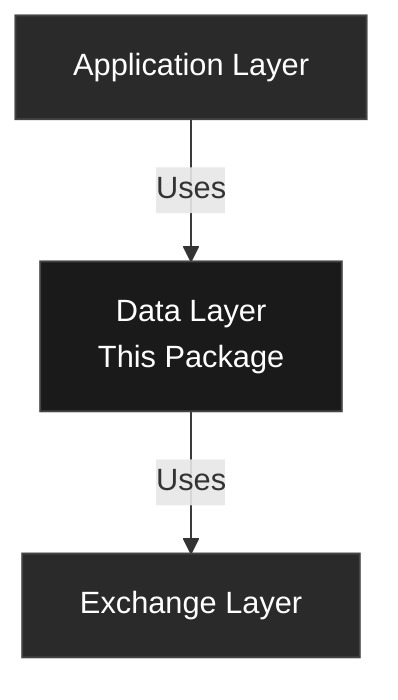

<svg width="400" height="100" xmlns="http://www.w3.org/2000/svg">
  <text x="10" y="45" font-family="system-ui, -apple-system, sans-serif" font-size="24" font-weight="300" fill="currentColor">
    FLOWSURFACE
  </text>
  <text x="10" y="70" font-family="system-ui, -apple-system, sans-serif" font-size="14" font-weight="300" fill="#666666">
    Data Layer
  </text>
  <line x1="10" y1="85" x2="350" y2="85" stroke="#999999" stroke-width="1"/>
</svg>

The data layer provides core business logic, domain models, and state management for the Flowsurface futures trading platform. This package maintains strict separation from external dependencies, implementing pure domain logic with no I/O operations.

## Architecture

```
data/
├── domain/         # Core domain models and business logic
├── repository/     # Data access abstractions
├── services/       # Business orchestration
├── state/          # Application state management
├── config/         # Configuration types
└── util/           # Utility functions
```

### Layer Boundaries



## Core Components

### Domain Models

Pure value objects and entities with no external dependencies.

#### Price (Fixed-Point Arithmetic)
```rust
pub struct Price {
    units: i64, // 10^-8 precision
}

impl Price {
    pub fn from_f32(value: f32) -> Self {
        Self { units: (value * 100_000_000.0) as i64 }
    }

    pub fn to_f32(&self) -> f32 {
        self.units as f32 / 100_000_000.0
    }
}
```

#### Trade
```rust
pub struct Trade {
    pub time: Timestamp,        // Note: 'time', not 'timestamp'
    pub price: Price,
    pub quantity: Quantity,
    pub side: Side,             // Buy or Sell
}

impl Trade {
    pub fn new(time: Timestamp, price: Price, quantity: Quantity, side: Side) -> Self;
    pub fn from_raw(time_millis: u64, price_f32: f32, quantity_f32: f32, is_sell: bool) -> Self;
    pub fn is_buy(&self) -> bool;
    pub fn is_sell(&self) -> bool;
    pub fn is_on_date(&self, date: NaiveDate) -> bool;
}
```

#### Depth Snapshot
```rust
use std::collections::BTreeMap;

pub struct DepthSnapshot {
    pub time: Timestamp,                          // Note: 'time', not 'timestamp'
    pub bids: BTreeMap<Price, Quantity>,         // Not Vec<Level>
    pub asks: BTreeMap<Price, Quantity>,
}

impl DepthSnapshot {
    pub fn best_bid(&self) -> Option<(Price, Quantity)>;
    pub fn best_ask(&self) -> Option<(Price, Quantity)>;
    pub fn mid_price(&self) -> Option<Price>;
    pub fn spread(&self) -> Option<Price>;
    pub fn total_bid_volume(&self) -> Quantity;
    pub fn total_ask_volume(&self) -> Quantity;
}
```

### Futures Domain

Pure domain types for futures markets.

#### FuturesTicker
```rust
pub struct FuturesTicker {
    // Efficient byte-packed storage (28 bytes)
    pub venue: FuturesVenue,
}

impl FuturesTicker {
    pub fn new(symbol: &str, venue: FuturesVenue) -> Self;

    // Symbol operations
    pub fn as_str(&self) -> &str;
    pub fn product(&self) -> &str;        // "ES" from "ES.c.0" or "ESH24"
    pub fn display_name(&self) -> Option<&str>;
    pub fn contract_type(&self) -> ContractType;

    // Expiration tracking (for specific contracts like "ESH24")
    pub fn expiration_date(&self) -> Option<NaiveDate>;
    pub fn is_expired(&self) -> bool;
    pub fn days_until_expiry(&self) -> Option<i64>;
}
```

#### ContractType
```rust
pub enum ContractType {
    Continuous(u8),      // e.g., ES.c.0 (front month)
    Specific(String),    // e.g., ESH24 (March 2024)
}
```

#### FuturesTickerInfo
```rust
pub struct FuturesTickerInfo {
    pub ticker: FuturesTicker,
    pub tick_size: f32,
    pub min_qty: f32,
    pub contract_size: f32,
}
```

#### Timeframe
```rust
pub enum Timeframe {
    M1s, M5s, M10s, M30s,  // Sub-minute
    M1, M3, M5, M15, M30,  // Minutes
    H1, H4,                // Hours
    D1,                    // Daily
}

impl Timeframe {
    pub fn to_milliseconds(self) -> u64;
    pub fn to_seconds(self) -> u64;
}
```

### Chart Domain

Domain types for chart configuration and data.

#### ChartConfig
```rust
pub struct ChartConfig {
    pub ticker: FuturesTicker,
    pub basis: ChartBasis,
    pub date_range: DateRange,
    pub chart_type: ChartType,
}
```

#### ChartBasis
```rust
pub enum ChartBasis {
    Time(Timeframe),  // Time-based: M1, M5, H1, etc.
    Tick(u32),        // Tick-based: 50T, 100T, etc.
}
```

#### ChartData
```rust
pub struct ChartData {
    pub trades: Vec<Trade>,              // PRIMARY SOURCE OF TRUTH
    pub candles: Vec<Candle>,            // DERIVED from trades
    pub depth_snapshots: Option<Vec<DepthSnapshot>>,
    pub time_range: TimeRange,
}

impl ChartData {
    pub fn has_trades(&self) -> bool;
    pub fn has_candles(&self) -> bool;
    pub fn has_depth(&self) -> bool;
    pub fn memory_usage(&self) -> usize;
}
```

### Repository Pattern

Abstract data access through trait definitions.

```rust
#[async_trait]
pub trait TradeRepository: Send + Sync {
    async fn get_trades(
        &self,
        ticker: &FuturesTicker,
        date_range: &DateRange,
    ) -> RepositoryResult<Vec<Trade>>;

    async fn store_trades(
        &self,
        ticker: &FuturesTicker,
        date: NaiveDate,
        trades: Vec<Trade>,
    ) -> RepositoryResult<()>;

    async fn find_gaps(
        &self,
        ticker: &FuturesTicker,
        date_range: &DateRange,
    ) -> RepositoryResult<Vec<DateRange>>;
}
```

### Services

Business logic orchestration with clean separation of concerns.

#### MarketDataService
```rust
pub struct MarketDataService {
    trade_repo: Arc<dyn TradeRepository>,
    loading_status: Arc<Mutex<HashMap<String, LoadingStatus>>>,
}
```

#### ReplayEngine
```rust
pub struct ReplayEngine {
    config: ReplayEngineConfig,
    state: Arc<RwLock<ReplayState>>,
    data: Arc<RwLock<Option<ReplayData>>>,
    event_tx: mpsc::UnboundedSender<ReplayEvent>,
    pub event_rx: mpsc::UnboundedReceiver<ReplayEvent>,
}
```

### State Management

Versioned application state with automatic migration.

```rust
pub struct AppState {
    pub version: u32,
    pub layouts: Vec<Layout>,
    pub theme: Theme,
    pub user_timezone: UserTimezone,
    pub sidebar: Sidebar,
}

// Automatic migration on load
let state = load_state("app-state.json")?;

// Persist changes
save_state(&state, "app-state.json")?;
```

## Usage Patterns

### Instant Basis Switching

One of the key features of the data layer is **instant basis switching**. Once trades are loaded into memory, you can switch between any timeframe or tick basis without refetching data.

```rust
// Initial load (15-25s first time, <1s if cached)
let config = ChartConfig {
    ticker: es_ticker,
    basis: ChartBasis::Time(Timeframe::M5),
    date_range: DateRange::last_n_days(7),
    chart_type: ChartType::Candlestick,
};

let service = MarketDataService::new(trade_repo, depth_repo);
let chart_data = service.get_chart_data(&config, &ticker_info).await?;
// Now have 7 days of trades in memory

// User switches to 1H candles (< 100ms)
let h1_data = service.rebuild_chart_data(
    &chart_data.trades,
    ChartBasis::Time(Timeframe::H1),
    &ticker_info
)?;

// User switches to 50-tick chart (< 100ms)
let tick_data = service.rebuild_chart_data(
    &chart_data.trades,
    ChartBasis::Tick(50),
    &ticker_info
)?;

// All basis changes are instant - no API calls!
```

**Performance**:
- First load: 15-25s (API bound)
- Cached load: <1s (local disk)
- Basis switch: <100ms (memory only)

### Aggregation

```rust
use flowsurface_data::domain::aggregation::{
    aggregate_trades_to_candles,
    aggregate_trades_to_ticks,
};

// Time-based aggregation
let candles = aggregate_trades_to_candles(
    &trades,
    60_000,  // 1 minute
    Price::from_f32(0.25),  // tick size
)?;

// Tick-based aggregation
let tick_bars = aggregate_trades_to_ticks(
    &trades,
    100,  // 100 trades per bar
    Price::from_f32(0.25),
)?;
```

### Repository Usage

```rust
// Repository implementations live in the exchange layer
use exchange::repository::DatabentoTradeRepository;
use data::repository::TradeRepository;

// Create repository instance (exchange layer provides implementation)
let repo: Arc<dyn TradeRepository> = Arc::new(
    DatabentoTradeRepository::new(config).await?
);

// Fetch trades with automatic gap detection
let trades = repo.get_trades(&ticker, &date_range).await?;

// Store trades (per-day caching)
repo.store_trades(&ticker, date, trades).await?;

// Check cache status
let has_data = repo.has_trades(&ticker, date).await?;

// Get repository statistics
let stats = repo.stats(&ticker).await?;
println!("Cache hit rate: {:.1}%", stats.hit_rate * 100.0);
```

### Replay Engine

```rust
// Initialize replay engine (note: depth_repo is optional)
let mut engine = ReplayEngine::new(
    ReplayEngineConfig::default(),
    trade_repo,
    Some(depth_repo)  // Option<Arc<dyn DepthRepository>>
);

// Load historical data
engine.load_data(ticker_info, date_range).await?;

// Control playback
engine.play().await?;
engine.set_speed(SpeedPreset::Double).await?;
engine.pause().await?;
engine.seek(timestamp).await?;
engine.jump(60_000).await?;  // Jump 1 minute forward

// Process events (full event set)
while let Some(event) = engine.event_rx.recv().await {
    match event {
        ReplayEvent::DataLoaded { ticker, trade_count, depth_count, time_range } => {
            println!("Loaded {} trades", trade_count);
        }
        ReplayEvent::LoadingProgress { progress, message } => {
            println!("Loading: {}% - {}", progress * 100.0, message);
        }
        ReplayEvent::MarketData { timestamp, trades, depth } => {
            // Process market data at current position
        }
        ReplayEvent::PositionUpdate { timestamp, progress } => {
            // Update progress bar
        }
        ReplayEvent::StatusChanged(status) => {
            // Handle status change
        }
        ReplayEvent::PlaybackComplete => {
            println!("Replay finished");
            break;
        }
        ReplayEvent::Error(msg) => {
            eprintln!("Error: {}", msg);
        }
        _ => {}
    }
}
```

## Performance Characteristics

### Memory Management

- **Streaming aggregation**: Process trades without loading entire dataset
- **Per-day caching**: Optimize memory usage with daily partitions
- **Fixed-point arithmetic**: Eliminate floating-point errors

### Benchmarks

| Operation | Time | Memory |
|-----------|------|--------|
| Load 1M trades | 250ms | 80MB |
| Aggregate to 1m candles | 15ms | 2MB |
| State persistence | 5ms | 1MB |

## Configuration

### Environment Variables

```bash
# Data directory (optional)
export FLOWSURFACE_DATA_PATH=/custom/path

# Log level
export RUST_LOG=flowsurface_data=debug
```

### Replay Engine Configuration

```rust
pub struct ReplayEngineConfig {
    pub buffer_window_ms: u64,      // Default: 60000
    pub emit_interval_ms: u64,      // Default: 100
    pub max_trades_per_emit: usize, // Default: 1000
    pub load_depth: bool,           // Default: true
    pub pre_aggregate: bool,        // Default: true
    pub event_buffer_size: usize,   // Default: 1000
    pub max_memory_mb: usize,       // Default: 500
}
```

## Testing

```bash
# Unit tests
cargo test --package flowsurface-data

# Integration tests
cargo test --package flowsurface-data --test '*'

# Benchmarks
cargo bench --package flowsurface-data
```

## API Reference

Complete API documentation available at:
```bash
cargo doc --package flowsurface-data --open
```

## Options Data & GEX Analysis

The data layer now supports options data alongside futures data, enabling gamma exposure (GEX) analysis.

### Options Domain Models

```rust
use flowsurface_data::domain::{OptionContract, OptionSnapshot, OptionChain, Greek};

// Option contract
let contract = OptionContract::new(
    "O:AAPL240119C00150000".to_string(),
    "AAPL".to_string(),
    Price::from_f64(150.0),
    NaiveDate::from_ymd_opt(2024, 1, 19).unwrap(),
    OptionType::Call,
    ExerciseStyle::American,
);

// Check expiration
println!("Days to expiry: {}", contract.days_to_expiry(today));
println!("Is expired: {}", contract.is_expired(today));

// Option snapshot with Greeks
let mut snapshot = OptionSnapshot::new(contract, Timestamp(now));
snapshot.greeks = Greek::new(0.5, 0.05, -0.02, 0.15);
snapshot.implied_volatility = Some(0.25);
snapshot.open_interest = Some(1000);

// Calculate values
println!("Mid price: {:?}", snapshot.mid_price());
println!("Intrinsic value: {:?}", snapshot.intrinsic_value());
println!("Is ITM: {:?}", snapshot.is_itm());
```

### GEX Profile Calculation

```rust
use flowsurface_data::domain::{GexProfile, OptionChain};
use flowsurface_data::services::GexCalculationService;

// Get option chain (from repository)
let chain: OptionChain = chain_repo.get_chain("SPY", date).await?;

// Calculate GEX profile
let gex_profile = GexProfile::from_option_chain(&chain);

// Or use the service
let gex_service = GexCalculationService::new();
let profile = gex_service.calculate_profile(&chain);

// Analyze gamma exposure
println!("Total net gamma: {}", profile.total_net_gamma);
println!("Key levels: {}", profile.key_levels.len());

if let Some(zero_gamma) = profile.zero_gamma_level {
    println!("Zero gamma level: ${:.2}", zero_gamma.to_f64());
}

// Find strongest levels
if let Some(resistance) = profile.strongest_resistance() {
    println!("Strongest resistance: ${:.2}", resistance.strike_price.to_f64());
}

if let Some(support) = profile.strongest_support() {
    println!("Strongest support: ${:.2}", support.strike_price.to_f64());
}
```

### Options Data Service

```rust
use flowsurface_data::services::OptionsDataService;
use flowsurface_exchange::{MassiveSnapshotRepository, MassiveChainRepository, MassiveContractRepository};

// Initialize repositories
let snapshot_repo = Arc::new(MassiveSnapshotRepository::new(config.clone()).await?);
let chain_repo = Arc::new(MassiveChainRepository::new(config.clone()).await?);
let contract_repo = Arc::new(MassiveContractRepository::new(config).await?);

// Create service
let options_service = OptionsDataService::new(snapshot_repo, chain_repo, contract_repo);

// Fetch chain with Greeks
let chain = options_service.get_chain_with_greeks("AAPL", date).await?;
println!("Loaded {} contracts", chain.contract_count());

// Get GEX profile
let gex_profile = options_service.get_gex_profile("AAPL", date).await?;
println!("Calculated {} exposure levels", gex_profile.exposure_count());

// Get historical IV
let date_range = DateRange::last_n_days(7);
let iv_history = options_service.get_historical_iv("AAPL", &date_range).await?;
println!("Loaded {} IV snapshots", iv_history.len());

// Search contracts
let active_contracts = options_service.get_active_contracts("AAPL", today).await?;
println!("Found {} active contracts", active_contracts.len());
```

### GEX Analysis

```rust
use flowsurface_data::services::GexCalculationService;

let gex_service = GexCalculationService::new();

// Analyze market regime
let regime = gex_service.determine_market_regime(&profile);
println!("Market regime: {}", regime); // "Positive Gamma", "Negative Gamma", etc.

// Calculate volatility expectation
let vol_score = gex_service.calculate_volatility_expectation(&profile);
println!("Volatility expectation: {:.1}/10", vol_score * 10.0);

// Check squeeze potential
let current_price = Price::from_f64(450.0);
if gex_service.has_squeeze_potential(&profile, current_price) {
    println!("⚠️ Gamma squeeze potential detected!");
}

// Analyze gamma skew
let (sentiment, ratio) = gex_service.analyze_gamma_skew(&profile);
println!("Sentiment: {}, Call/Put Ratio: {:.2}", sentiment, ratio);

// Find key levels near current price
if let Some(nearest_resistance) = gex_service.nearest_resistance_above(&profile, current_price) {
    println!("Next resistance: ${:.2}", nearest_resistance.to_f64());
}

if let Some(nearest_support) = gex_service.nearest_support_below(&profile, current_price) {
    println!("Next support: ${:.2}", nearest_support.to_f64());
}
```

## License

GPL-3.0-or-later
