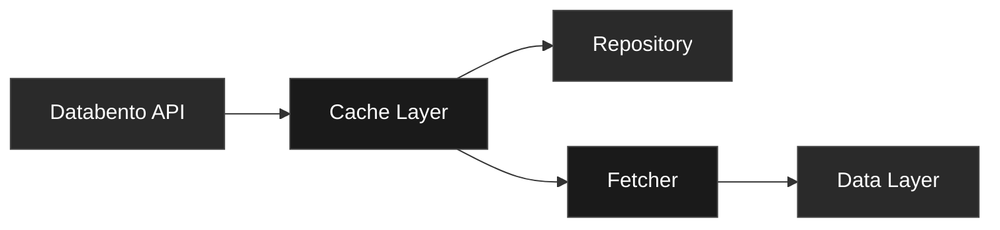

<svg width="400" height="100" xmlns="http://www.w3.org/2000/svg">
  <text x="10" y="45" font-family="system-ui, -apple-system, sans-serif" font-size="24" font-weight="300" fill="currentColor">
    FLOWSURFACE
  </text>
  <text x="10" y="70" font-family="system-ui, -apple-system, sans-serif" font-size="14" font-weight="300" fill="#666666">
    Exchange Layer
  </text>
  <line x1="10" y1="85" x2="350" y2="85" stroke="#999999" stroke-width="1"/>
</svg>

The exchange layer provides market data integration, caching, and adapter implementations for external data sources. Currently features a complete Databento adapter for CME Globex futures markets with intelligent caching and cost optimization.

## Architecture

```
exchange/
├── adapter/        # Exchange-specific adapters
│   └── databento/  # Databento API integration
├── repository/     # Repository implementations
├── config.rs       # Configuration management
└── types.rs        # Exchange-specific types
```

### Data Flow



## Databento Integration

### Configuration

The exchange layer provides two configuration approaches:

#### Simple Configuration (for adapter)
```rust
pub struct DatabentoConfig {
    pub api_key: String,
    pub dataset: Dataset,            // Enum type (not String)
    pub cache_enabled: bool,         // Default: true
    pub cache_max_days: u32,         // Default: 30
    pub auto_backfill: bool,         // Default: false
    pub cache_dir: PathBuf,          // Default: "./cache/databento"
    pub warn_on_expensive_calls: bool, // Default: true
}
```

#### Production Configuration (with builder)
```rust
pub struct Config {
    pub databento: DatabentoConfig,
    pub fetching: FetchingConfig,
    pub cache: CacheConfig,
    pub cost: CostConfig,
    pub network: NetworkConfig,
    pub validation: ValidationConfig,
}
```

### Cost Optimization

Schema cost scale (1-10, 10 being most expensive):

| Schema | Cost | Use Case |
|--------|------|----------|
| OHLCV-1D | 1 | Daily bars |
| Trades | 2 | Tick data |
| MBP-1 | 2 | Best bid/ask |
| MBP-10 | 3 | 10-level depth |
| MBO | 10 | Full order book |

### Intelligent Caching

Per-day caching strategy minimizes API calls:

```
cache/
└── databento/
    ├── trades/
    │   └── ES-c-0/  # Note: dots replaced with dashes
    │       ├── 2024-01-01.dbn.zst  # Databento binary format with Zstd compression
    │       └── 2024-01-02.dbn.zst
    └── mbp10/
        └── ES-c-0/
            └── 2024-01-01.dbn.zst
```

**Cache Format:** Files use `.dbn.zst` extension (Databento's native binary format with Zstd compression), not Parquet. This provides optimal performance and compatibility with the Databento SDK.

## API Reference

### Historical Data Manager

```rust
let mut manager = HistoricalDataManager::new(config).await?;

// Fetch trades (automatically cached)
let trades = manager.fetch_trades_cached("ES.c.0", (start, end)).await?;

// Fetch order book snapshots
let snapshots = manager.fetch_mbp10_cached("NQ.c.0", (start, end)).await?;

// Fetch OHLCV bars (note: timeframe is a Timeframe enum, not string)
use exchange::domain::Timeframe;
let bars = manager.fetch_ohlcv("CL.c.0", Timeframe::H1, (start, end)).await?;

// Fetch open interest (undocumented feature)
let open_interest = manager.fetch_open_interest("ES.c.0", (start, end)).await?;

// Cache management
let stats = manager.cache_stats().await?;
println!("Cache size: {} MB", stats.total_size / 1_000_000);

// Clean up old cache files
let removed = manager.cleanup_cache().await?;
println!("Removed {} old cache files", removed);
```

### WebSocket Client

Two WebSocket implementations are available:

#### Basic WebSocket Client
```rust
let mut client = DatabentoWebSocketClient::new(config);

// Connect and subscribe
client.connect().await?;
client.subscribe(StreamKind::DepthAndTrades { ticker_info }).await?;

// Process events
while let Some(event) = client.event_rx.recv().await {
    match event {
        Event::Trade(trade) => process_trade(trade),
        Event::DepthUpdate(depth) => process_depth(depth),
        _ => {}
    }
}
```

#### Enhanced WebSocket Client (Production)
```rust
// Features automatic reconnection, health monitoring, and graceful error recovery
let mut client = EnhancedWebSocketClient::new(config, reconnection_config);

// Connection configuration
pub struct ReconnectionConfig {
    pub enabled: bool,                  // Default: true
    pub initial_delay_ms: u64,          // Default: 1000
    pub max_delay_ms: u64,              // Default: 30000
    pub max_attempts: u32,              // Default: 10
    pub backoff_multiplier: f32,        // Default: 1.5
    pub health_check_interval_secs: u64, // Default: 30
    pub max_idle_secs: u64,             // Default: 60
}

// Monitor connection health
let health = client.connection_health();
match health.state {
    ConnectionState::Connected => println!("Connected"),
    ConnectionState::Reconnecting { attempt } => println!("Reconnecting (attempt {})", attempt),
    ConnectionState::Failed => println!("Connection failed"),
    _ => {}
}

// Process events with automatic recovery
while let Some(event) = client.event_rx.recv().await {
    // Handle events - connection will automatically recover on failure
}
```

### Repository Implementations

```rust
// Trade repository
let trade_repo = DatabentoTradeRepository::new(config).await?;
let trades = trade_repo.get_trades(&ticker, &date_range).await?;

// Depth repository
let depth_repo = DatabentoDepthRepository::new(config).await?;
let depth = depth_repo.get_depth(&ticker, &date_range).await?;
```

## Configuration Management

### Configuration Profiles

```rust
// Development
let config = Config::for_profile(ConfigProfile::Development);

// Staging
let config = Config::for_profile(ConfigProfile::Staging);

// Production
let config = Config::for_profile(ConfigProfile::Production);
```

### Configuration Builder

```rust
let config = ConfigBuilder::new(ConfigProfile::Production)
    .with_api_key(api_key)
    .with_cache_dir("./cache")
    .with_cache_size(10000) // 10GB
    .with_daily_budget(500.0)
    .strict()
    .validate()?
    .build();
```

### Validation

Comprehensive validation ensures configuration integrity:

```rust
config.validate()?; // Validates all settings

// Individual validations
config.databento.validate()?;     // API key, timeouts
config.cache.validate()?;          // Permissions, size
config.cost.validate()?;           // Budget limits
config.network.validate()?;        // Timeout consistency
```

## Supported Instruments

CME Globex futures with automatic configuration:

| Symbol | Product | Tick Size | Multiplier |
|--------|---------|-----------|------------|
| ES.c.0 | E-mini S&P 500 | 0.25 | 50 |
| NQ.c.0 | E-mini Nasdaq | 0.25 | 20 |
| YM.c.0 | E-mini Dow | 1.0 | 5 |
| RTY.c.0 | Russell 2000 | 0.1 | 50 |
| ZN.c.0 | 10-Year T-Note | 0.015625 | 1000 |
| GC.c.0 | Gold | 0.10 | 100 |
| CL.c.0 | Crude Oil | 0.01 | 1000 |

## Performance Metrics

### Cache Performance

| Operation | Time | Description |
|-----------|------|-------------|
| Cache hit | <1ms | Local file read |
| Cache miss | 100-500ms | API fetch + cache write |
| Gap detection | 5ms | Date range analysis |
| Cleanup | 50ms/GB | Old file removal |

### Memory Usage

| Data Type | Memory/Million | Compression |
|-----------|----------------|-------------|
| Trades | 80MB | 60% with Parquet |
| MBP-10 | 240MB | 70% with Parquet |
| OHLCV | 20MB | 50% with Parquet |

## Cost Management

### Daily Budget Tracking

```rust
let usage = manager.get_daily_usage().await?;
println!("Today's cost: ${:.2}", usage.cost);
println!("Remaining budget: ${:.2}", config.cost.daily_budget - usage.cost);
```

### Cost Warnings

```rust
if config.cost.warn_on_expensive {
    let estimate = config.cost.estimate_cost("MBO", 30);
    if estimate > config.cost.max_cost_per_request {
        // Warning: expensive operation
    }
}
```

## Price Utilities

The exchange layer provides fixed-point arithmetic for accurate financial calculations:

```rust
pub struct Price {
    pub units: i64,  // atomic units (10^-8 precision)
}

impl Price {
    pub const PRICE_SCALE: i32 = 8;

    // Conversions
    pub fn to_f32_lossy(self) -> f32;
    pub fn from_f32_lossy(v: f32) -> Self;

    // Rounding
    pub fn round_to_step(self, step: PriceStep) -> Self;
    pub fn round_to_min_tick(self, min_tick: MinTicksize) -> Self;
    pub fn round_to_side_step(self, is_sell_or_bid: bool, step: PriceStep) -> Self;

    // Arithmetic
    pub fn add_steps(self, steps: i64, step: PriceStep) -> Self;
    pub fn steps_between_inclusive(low: Price, high: Price, step: PriceStep) -> Option<usize>;
}
```

## Error Handling

Three error types handle different concerns:

```rust
// Main error type (error.rs)
pub enum Error {
    Fetch(String),
    Parse(String),
    Config(String),
    Cache(String),
    Symbol(String),
    Validation(String),
    Databento(#[from] databento::Error),
    Dbn(#[from] databento::dbn::Error),
    Io(#[from] std::io::Error),
}

// Adapter error (adapter/mod.rs)
pub enum AdapterError {
    FetchError(#[from] reqwest::Error),
    ParseError(String),
    InvalidRequest(String),
}

// Databento-specific error (adapter/databento/mod.rs)
pub enum DatabentoError {
    Api(#[from] databento::Error),
    Dbn(#[from] databento::dbn::Error),
    SymbolNotFound(String),
    InvalidInstrumentId(u32),
    Cache(String),
    Config(String),
}
```

All error types include helper methods for error classification:
```rust
impl Error {
    pub fn user_message(&self) -> String;  // UI-safe messages
    pub fn is_retriable(&self) -> bool;    // Retry logic
    pub fn severity(&self) -> Severity;    // Logging levels
}
```

## Testing

```bash
# Unit tests
cargo test --package flowsurface-exchange

# Integration tests (requires API key)
DATABENTO_API_KEY=your_key cargo test --package flowsurface-exchange -- --ignored

# Note: Mock feature is not currently implemented
```

## Environment Variables

```bash
# Required
export DATABENTO_API_KEY=your_api_key

# Optional
export FLOWSURFACE_PROFILE=production  # development|staging|production
export FLOWSURFACE_CACHE_DIR=/custom/cache/path
export RUST_LOG=flowsurface_exchange=debug
```

## Massive (Polygon) Options Integration

The exchange layer now includes a complete Massive API adapter for US options market data.

### Configuration

```rust
use flowsurface_exchange::MassiveConfig;

// From environment variable
let config = MassiveConfig::from_env()?;

// Or create manually
let config = MassiveConfig::new("your_polygon_api_key".to_string());

// Customize settings
config.cache_enabled = true;
config.cache_max_days = 90;
config.rate_limit_per_minute = 5;
config.timeout_secs = 30;

// Validate
config.validate()?;
```

### Historical Options Manager

```rust
use flowsurface_exchange::HistoricalOptionsManager;

let manager = HistoricalOptionsManager::new(config).await?;

// Fetch option chain with Greeks and IV
let chain = manager.fetch_option_chain("AAPL", date).await?;
println!("Loaded {} contracts", chain.contract_count());

// Fetch multiple days with gap detection
let chains = manager.fetch_option_chains("SPY", &date_range).await?;
println!("Loaded {} days of chains", chains.len());

// Fetch contract metadata
let contracts = manager.fetch_contracts_metadata("TSLA").await?;
println!("Found {} available contracts", contracts.len());

// Cache statistics
let stats = manager.cache_stats().await?;
println!("Cache size: {}", stats.size_human_readable());

// Cleanup old cache files
let removed = manager.cleanup_cache().await?;
println!("Removed {} old files", removed);
```

### Repository Implementations

```rust
use flowsurface_exchange::{MassiveSnapshotRepository, MassiveChainRepository, MassiveContractRepository};

// Create repositories
let snapshot_repo = MassiveSnapshotRepository::new(config.clone()).await?;
let chain_repo = MassiveChainRepository::new(config.clone()).await?;
let contract_repo = MassiveContractRepository::new(config).await?;

// Use repository traits
use flowsurface_data::repository::{OptionSnapshotRepository, OptionChainRepository};

// Fetch chain
let chain = chain_repo.get_chain("AAPL", date).await?;

// Fetch filtered chain
let near_atm_chain = chain_repo.get_chain_by_strike_range(
    "AAPL",
    date,
    145.0,  // min strike
    155.0,  // max strike
).await?;

// Fetch specific expiration
let march_chain = chain_repo.get_chain_by_expiration(
    "AAPL",
    date,
    NaiveDate::from_ymd_opt(2024, 3, 15).unwrap(),
).await?;

// Get contracts
let all_contracts = contract_repo.get_contracts("AAPL").await?;
let active_only = contract_repo.get_active_contracts("AAPL", today).await?;
```

### Caching Strategy

**Directory Structure:**
```
cache/massive/
├── chains/
│   ├── AAPL/
│   │   ├── 2024-01-01.json.zst
│   │   └── 2024-01-02.json.zst
│   └── SPY/
│       └── 2024-01-01.json.zst
├── snapshots/
│   └── TSLA/
│       └── 2024-01-01.json.zst
└── contracts/
    └── AAPL/
        └── metadata.json.zst
```

**Features:**
- Per-day JSON caching with Zstandard compression (~60% size reduction)
- Automatic gap detection minimizes API calls
- Configurable max age for cache files
- Cache statistics and cleanup utilities

### Rate Limiting

```rust
// Configure rate limit
let config = MassiveConfig {
    rate_limit_per_minute: 5,  // 5 requests per minute
    warn_on_rate_limits: true,
    ..Default::default()
};

// Client automatically:
// - Tracks requests in 60-second window
// - Waits when limit reached
// - Respects Retry-After headers
// - Logs warnings when approaching limits
```

### Error Handling

```rust
use flowsurface_exchange::MassiveError;

match manager.fetch_option_chain("INVALID", date).await {
    Ok(chain) => println!("Success: {} contracts", chain.contract_count()),
    Err(MassiveError::SymbolNotFound(symbol)) => {
        eprintln!("Symbol '{}' not found", symbol);
    }
    Err(MassiveError::RateLimit(msg)) => {
        eprintln!("Rate limited: {}", msg);
    }
    Err(MassiveError::Auth(msg)) => {
        eprintln!("Authentication failed: {}", msg);
    }
    Err(e) => {
        eprintln!("Error: {}", e.user_message());
        if e.is_retriable() {
            println!("This error can be retried");
        }
    }
}
```

### Performance

| Operation | Time | Description |
|-----------|------|-------------|
| First chain fetch | 1-3s | API fetch + cache write |
| Cached chain load | <100ms | Local JSON decompression |
| Gap detection | <10ms | File system check |
| Contract metadata | 500ms-1s | One-time API fetch, cached indefinitely |

### Environment Variables

```bash
# Required for options data
export MASSIVE_API_KEY=your_polygon_api_key

# Optional
export FLOWSURFACE_CACHE_DIR=/custom/cache/path
export RUST_LOG=flowsurface_exchange=debug
```

## License

GPL-3.0-or-later
